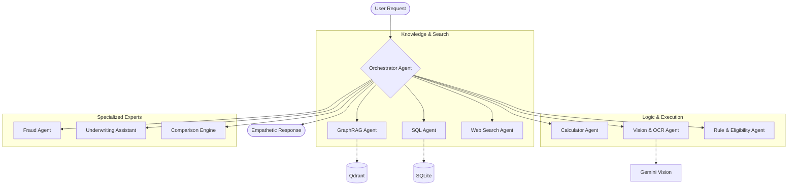

# InsureVN 🛡️ — AI-Powered Multi-Agent Insurance Ecosystem

[](https://www.python.org/downloads/release/python-3120/)
[](https://python.langchain.com/)
[](https://deepmind.google/technologies/gemini/)
[](https://qdrant.tech/)

**InsureVN** is a production-grade, multi-agent AI system designed to automate and optimize the full insurance lifecycle for the Vietnamese market. By transforming complex, unstructured policy documents into actionable intelligence, InsureVN bridges the gap between insurance providers and customers.

---

## 🚀 Core Mission

Insurance in Vietnam faces three critical challenges:

1. **Impenetrable Legal Language**: Policy documents are often 50+ pages of complex jargon.
2. **Fragmented Processes**: Claiming is manual, slow, and prone to error or fraud.
3. **Unstructured Data**: 90% of insurance intelligence is trapped in PDFs and images.

**InsureVN solves this by:**

- 🧠 **Simplifying**: Explaining complex clauses in plain Vietnamese.
- ⚡ **Automating**: Extracting structured data from medical bills and IDs in seconds.
- 🛡️ **Protecting**: Detecting fraud and identifying "gotcha" clauses before they affect users.

---

## 🏗️ System Architecture

InsureVN utilizes a **Hierarchical Swarm Architecture** powered by **LangGraph**. A central Orchestrator delegates tasks to specialized expert agents.



### Key Agents

- **Orchestrator**: The central brain that routes queries and synthesizes final answers.
- **PolicyAgent**: Uses RAG over Qdrant to explain specific policy clauses.
- **ClaimAgent**: Evaluates eligibility and guides users through the submission process.
- **DocumentAgent**: High-fidelity OCR and structured data extraction (PII-aware).
- **FraudAgent**: Detects suspicious patterns in claim history and documents.

---

## 🛠️ Technology Stack

| Layer                   | Technology                                         |
| :---------------------- | :------------------------------------------------- |
| **Language**      | Python 3.12.3                                      |
| **Orchestration** | LangChain, LangGraph                               |
| **LLM Models**    | Google Gemini (Pro/Flash/Vision), Gemma-4          |
| **Vector DB**     | Qdrant (Knowledge Base)                            |
| **Relational DB** | SQLite (User Profiles, Payouts, Hospital Networks) |
| **Extraction**    | Firecrawl (Acquisition), Vision LLMs (OCR)         |
| **API**           | FastAPI                                            |

---

## 📊 Data Pipeline (ETL)

InsureVN features a robust pipeline that converts raw insurance documents into a queryable relational database.

1. **Acquisition**: `scripts/01_acquisition/` — Scraping and collection via Firecrawl.
2. **Extraction**: `scripts/04_extraction/` — OCR and Vision-to-JSON extraction using LLMs.
3. **Classification**: `scripts/04_extraction/11_llm_schema_mapping.py` — Dynamic key-set classification.
4. **Ingestion**: `scripts/06_db_ingestion/02_ingest_with_mapping.py` — Normalizing and loading into SQLite.

---

## 🗺️ Project Roadmap & Current Progress

### Phase 1: Data Acquisition (Done ✅)

- [X] Multi-site PDF scrapers (AIA, Pacific Cross, BIC, etc.)
- [X] **Firecrawl** integration for deep web crawling.
- [X] Automated document download and tracking.

### Phase 2: Preprocessing & Organization (Done ✅)

- [X] **Ollama-based** PDF classification (Policy vs. Brochure vs. Pricing).
- [X] Automated folder hierarchy organization.
- [X] PDF-to-Markdown conversion using **Marker** and **Datalab**.

### Phase 3: AI Extraction Engine (In Progress 🚧)

- [X] Vision LLM table extraction (Gemma-4).
- [X] **LLM Schema Mapping**: Handling heterogeneous JSON keys across 6 companies.
- [X] "Good vs. Trash" content classifier to filter OCR noise.
- [X] **Gemma-4 Fine-tuning**: Custom VLM training for Vietnamese insurance tables.

### Phase 4: Structured Knowledge Base (Done ✅)

- [X] **SQLite Design**: Normalized schema for benefits, premiums, and networks.
- [X] **Relational Ingestion**: Automated mapping of 600+ JSON tables to SQLite.
- [X] Data lineage tracking from DB back to original JSON/PDF.

### Phase 5: Multi-Agent Intelligence (Next Steps 🚀)

- [ ] **Orchestrator**: LangGraph-based central router.
- [ ] **PolicyAgent**: RAG-based explanation engine.
- [ ] **ClaimAgent**: Eligibility and payout calculation logic.
- [ ] **FraudAgent**: Pattern-based fraud detection.

---

## 📁 Project Structure

```text
InsureVN/
├── src/                  # Core Source Code
│   ├── agents/           # Specialized LangGraph agents
│   ├── tools/            # Reusable tools (OCR, DB, Search)
│   ├── api/              # FastAPI endpoints
│   ├── models/           # Pydantic & DB schemas
│   └── core/             # Configuration & LLM setup
├── scripts/              # ETL Pipeline & Research
│   ├── 01_acquisition/   # Scraping
│   ├── 04_extraction/    # OCR & Data Extraction
│   └── 06_db_ingestion/  # SQLite Loading
├── docs/                 # Extensive Technical Documentation
├── database/             # SQLite database files
└── data/                 # Raw/Processed JSON/PDF data
```

---

## 🚦 Getting Started

### 1. Prerequisites

- Python 3.12+
- `pip install -r requirements.txt` (Coming soon)
- Environment variables in `.env` (Gemini API Key, Qdrant URL)

### 2. Running the Pipeline

```bash
# Extract data from PDFs
python scripts/04_extraction/01_extract_doc_structures.py

# Map and Ingest to Database
python scripts/06_db_ingestion/02_ingest_with_mapping.py
```

### 3. Starting the API

```bash
uvicorn src.main:app --reload
```

---

## 📖 Documentation Index

For deeper technical insights, please refer to the `docs/` directory:

- [Architecture Design](docs/multi_agent_system_architecture_design.md)
- [Database Schema Specification](docs/sqlite_database_schema_specification.md)
- [Insurance Lifecycle Solutions](docs/insurance_lifecycle_ai_solutions_mapping.md)
- [100 Customer Intent Scenarios](docs/customer_intent_scenarios_100_questions.md)

---

## 🛡️ License

© 2026 InsureVN Team. All rights reserved. Built with ❤️ for the Vietnamese Insurance Community.
