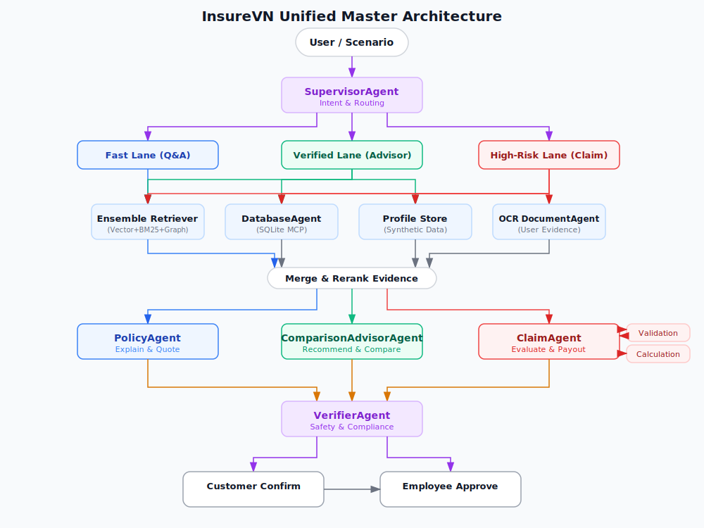
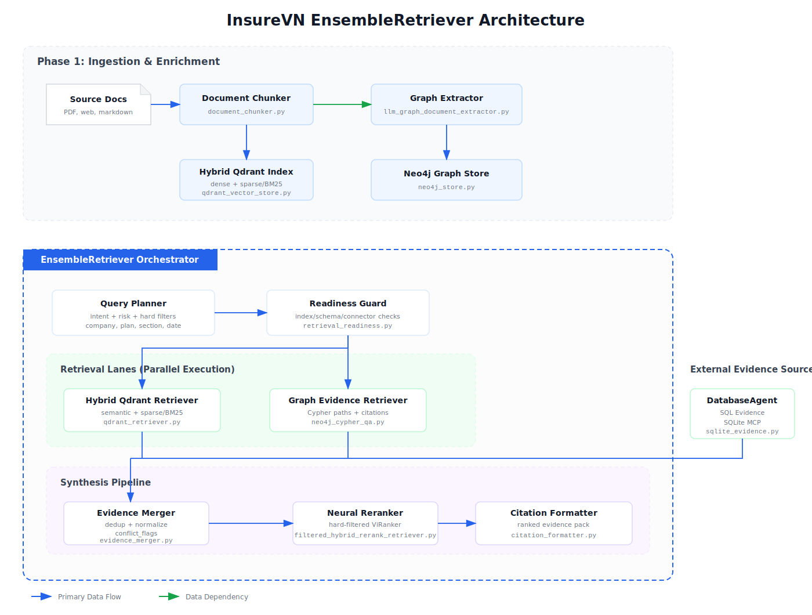
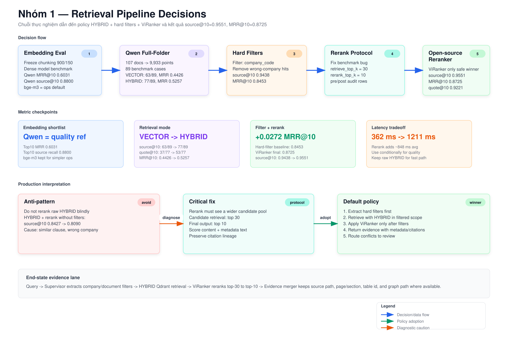
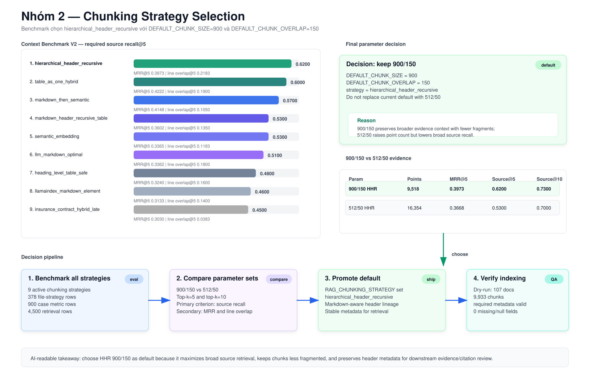
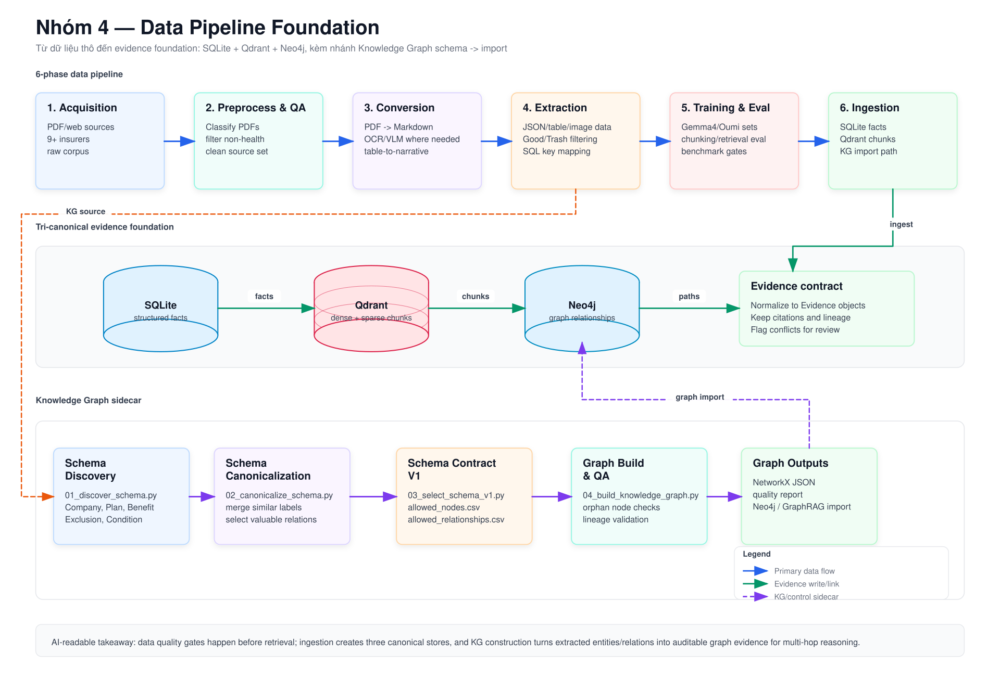
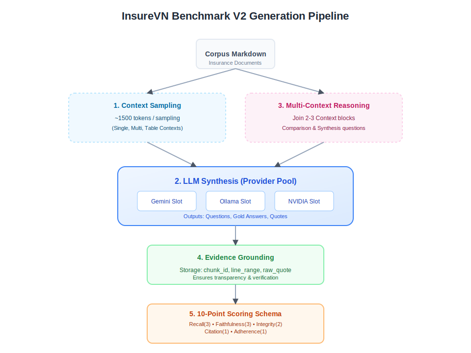

<p align="center">
  <b>English</b> | <a href="docs/README.md">Documentation Map</a>
</p>

<p align="center">
  
</p>

<h1 align="center">InsureVN: AI Swarm Platform for Vietnamese Insurance</h1>

<p align="center">
  <strong>One Shared Evidence Foundation to Empower Your Insurance Workflows</strong>
</p>

<p align="center">
  
  
  
  
  
  
</p>

<p align="center">
  
  
  
  
</p>

<p align="center">
  <a href="#overview">Overview</a> •
  <a href="#architecture">Architecture</a> •
  <a href="#system-diagrams">Diagrams</a> •
  <a href="#key-features">Features</a> •
  <a href="#tech-stack">Stack</a> •
  <a href="#project-structure">Structure</a> •
  <a href="#work-log">Work Log</a> •
  <a href="#roadmap">Roadmap</a>
</p>

<hr />

## Overview

InsureVN is a **Hybrid Full Agent Swarm** platform designed to solve pain points for employees, customers, and stakeholders in the Vietnamese health insurance ecosystem. Instead of a single monolithic chatbot, the system uses specialized AI agents — each with defined boundaries, evidence contracts, and human review gates — orchestrated through LangGraph workflows.

The platform processes real Vietnamese insurance documents (PDFs, policy tables, benefit schedules) through a **7-phase data pipeline**, indexing them into a **tri-canonical evidence foundation** (SQLite for structured facts, Qdrant for document text, Neo4j for entity relationships). It uses **Quad-Retrieval** (semantic vector + BM25 keyword + graph traversal + structured SQL lookup) to ground agent responses in verified evidence.

High-risk workflows (claims, payouts, rejections) are fully orchestrated with evidence contracts, calculation verification, and two-step human review (customer confirms facts → employee approves decision).

## Architecture



InsureVN uses a **Hybrid Full Agent Swarm** with three execution lanes based on intent risk:

- **Fast Lane (Q&A)** — Direct policy explanation using the Ensemble Retriever.
- **Verified Lane (Advisor)** — Comparison and recommendations with profile-store grounding.
- **High-Risk Lane (Claim)** — Complex claim/payout workflows with OCR and human review gates.

| Agent                  | Role                                                        | Status         |
| ---------------------- | ----------------------------------------------------------- | -------------- |
| SupervisorAgent        | Intent classification, risk routing, hard filter extraction | Designed       |
| DatabaseAgent          | Structured data queries over SQLite MCP                     | ✅ Implemented |
| PolicyAgent            | Policy clause explanation from evidence                     | Designed       |
| ComparisonAdvisorAgent | Plan comparison and recommendations                         | Designed       |
| ClaimAgent             | Claim decision drafting with evidence                       | Designed       |
| ValidationAgent        | Blind review judge, self-correction trigger                 | Designed       |
| CalculationAgent       | Deterministic premium/payout computation                    | Designed       |
| VerifierAgent          | Evidence sufficiency and citation checks                    | Designed       |
| OCR DocumentAgent      | User-uploaded document processing                           | Designed       |

For full details, see [Multi-Agent Platform Design](docs/architecture/2026-05-03-multi-agent-platform-design.md) and [Quad-Retrieval RAG Architecture](docs/architecture/2026-05-04-quad-retrieval-rag-architecture.md).

## System Diagrams

Visual reference for the core subsystems. Each diagram corresponds to an implemented or benchmarked component.

---

### Ensemble Retriever — Quad-Retrieval Architecture



> Ingestion (Phase 1) chunks documents into a **Hybrid Qdrant Index** (dense + sparse/BM25) and a **Neo4j Graph Store**. At query time, the EnsembleRetriever orchestrator runs parallel retrieval across Hybrid Qdrant, Graph Evidence (Cypher), and DatabaseAgent (SQLite), then merges → neural reranks via ViRanker → formats citations.

---

### Retrieval Pipeline Decisions — From Embedding to Production Policy



> **Decision chain**: Embedding benchmark (Qwen = quality ref) → HYBRID outperforms VECTOR (63→77/89 source hits on 107-doc corpus) → Hard filters eliminate wrong-company contamination → ViRanker rerank on top-30 candidates → top-10 final output. **Final policy**: `HYBRID + hard filters + ViRanker` achieving **source@10=0.9551**, **MRR@10=0.8725**. Rerank adds ~848ms latency; raw HYBRID kept as fast-path fallback.

---

### Chunking Strategy Selection — Benchmark-Driven Decision



> **Result**: `hierarchical_header_recursive` ranks #1 across 9 strategies with **source@5=0.6200**, MRR@5=0.3973. Final parameters: `DEFAULT_CHUNK_SIZE=900`, `DEFAULT_CHUNK_OVERLAP=150` — producing 9,518 chunks (vs 16,354 for 512/50) while preserving broader evidence context and Markdown header lineage for citation tracing.

---

### Data Pipeline Foundation — Raw PDF to Tri-Canonical Storage



> **6-phase pipeline**: Acquisition (9+ insurers) → Preprocess & QA (classify, filter non-health) → Conversion (PDF→Markdown, table-to-narrative) → Extraction (JSON/table/image, Good/Trash filtering) → Training & Eval (Gemma4/Oumi benchmark gates) → Ingestion (SQLite facts, Qdrant chunks, Neo4j graph). The **KG sidecar** runs schema discovery → canonicalization → contract → build → import in parallel.

---

### Knowledge Graph Schema — Entity & Relationship Discovery


> LLM-guided pipeline extracts candidate entity types and relationships from the Markdown corpus (01_discover_schema.py), merges duplicates into a governed schema contract (02-03 scripts), then builds real entities and relationships (04_build_knowledge_graph.py), outputting `insurevn_graph.json` and a quality report for Neo4j/GraphRAG import.

---

### Benchmark V2 Generation Pipeline



> Automated generation of 89 benchmark cases from the insurance corpus. Context sampling (single + multi-context blocks) feeds LLM Synthesis (Gemini, Ollama, NVIDIA slots) to produce questions, gold answers, and raw quotes. Evidence grounding preserves `chunk_id` + line ranges. Cases scored on a **10-point schema**: Recall(3) · Faithfulness(3) · Integrity(2) · Citation(1) · Adherence(1).

---

## Key Features

- **Quad-Retrieval RAG Engine** — Hybrid dense vector + sparse BM25 search on Qdrant with mandatory hard filters (company, document, plan) to prevent cross-company contamination
- **Filtered Hybrid Rerank Pipeline** — Production retrieval using `HYBRID + hard filters + ViRanker rerank`, achieving source@10=0.9551 and MRR@10=0.8725 on the health insurance benchmark
- **DatabaseAgent** — LangChain agent over SQLite via FastMCP server with 12 specialized tools (search_benefits, compare_benefits, get_premium_quotes, etc.)
- **Knowledge Graph** — Neo4j-backed entity relationship graph with LLM-assisted schema discovery and canonicalization pipeline
- **Evidence Models** — Pydantic-based Evidence, Citation, RetrievalPlan, and HardFilters schemas with full source lineage
- **7-Phase Data Pipeline** — Acquisition → Preprocessing & QA → Conversion & Interpretation → Extraction & Good/Trash filtering → Training & Eval → Database Ingestion → Knowledge Graph construction
- **Production Embeddings** — Qwen/Qwen3-Embedding-8B with 4-bit quantization, last-token pooling, and MRL dimension truncation
- **Langfuse Observability** — Full tracing of agent reasoning, tool calls, HTTP spans, prompt versioning, and evaluation scores
- **Vietnamese NLP** — Diacritics normalization, ASCII transliteration, and Vietnamese-optimized reranking with namdp-ptit/ViRanker

## Tech Stack

| Layer           | Technology                                                             |
| --------------- | ---------------------------------------------------------------------- |
| Language        | Python 3.12.3                                                          |
| API Runtime     | FastAPI, Uvicorn                                                       |
| Agent Framework | LangChain, LangGraph, Deep Agents                                      |
| LLM Providers   | Google Gemini, Ollama, OpenRouter, NVIDIA NIM                          |
| Embeddings      | Qwen/Qwen3-Embedding-8B (production), FastEmbed, Sentence-Transformers |
| Reranking       | namdp-ptit/ViRanker (HuggingFace CrossEncoder)                         |
| Vector Database | Qdrant (dense + sparse/BM25 hybrid)                                    |
| Structured Data | SQLite + FastMCP server                                                |
| Graph Database  | Neo4j (via langchain-neo4j), NetworkX (diagnostics/fixtures)           |
| Observability   | Langfuse (tracing, prompt management, eval)                            |
| PDF/OCR         | Marker                                                                 |
| VLM Finetune    | Unsloth                                                                |
| Evaluation      | DeepEval, LlamaIndex (LLM judge)                                       |
| Vietnamese NLP  | Normalization & Transliteration                                        |
| Testing         | pytest, ruff                                                           |

## Project Structure

```
InsureVN/
├── src/                          # Core application source code
│   ├── main.py                    # FastAPI entry point
│   ├── agents/                    # AI agents (DatabaseAgent)
│   ├── core/                      # Config, logger, database, Vietnamese text utils
│   ├── models/                    # Pydantic schemas (Evidence, Citation, RetrievalPlan)
│   ├── services/                  # Stateless service modules
│   │   ├── chunking/              # Document chunking strategies
│   │   ├── document_retrieval/    # Qdrant retriever, embedding, reranking
│   │   ├── evidence/              # Evidence merger, citation formatter
│   │   └── knowledge_graph/       # Neo4j store, graph schema, NetworkX builder
│   ├── eval/                      # Evaluation framework (chunking, embedding, retrieval, reranking)
│   ├── tools/                     # MCP client, Tavily search tool
│   ├── mcp_servers/sqlite/        # FastMCP SQLite server
│   └── prompts/                   # Agent system prompts
├── scripts/                      # Data pipeline scripts (7 phases) + research tools
│   ├── 01_acquisition/            # PDF/web scraping
│   ├── 02_preprocessing/          # PDF classification and organization
│   ├── 03_conversion/             # PDF → Markdown, table-to-text
│   ├── 04_extraction/             # OCR, JSON extraction, content classification
│   ├── 05_training_eval/          # VLM training, benchmark generation, eval runners
│   ├── 06_db_ingestion/           # SQLite, Qdrant, Graph ingestion
│   ├── 07_knowledge_graph/        # KG schema discovery and construction
│   ├── 08_chunking_compare/       # Research: chunking strategy comparison tool
│   └── 09_databricks_chunking_strategies/  # Research: advanced chunking experiments
├── tests/                        # Test suite (unit, integration, e2e)
├── docs/                         # Documentation
├── CICD/                         # Docker Compose (Qdrant, Neo4j, Langfuse)
├── database/                     # SQLite DB, Qdrant storage, Neo4j data
├── config/                       # Fine-tuning dataset configs
└── asset/                        # Architecture diagrams and images
```

## Agent System

Currently implemented:

- **DatabaseAgent** (`src/agents/database_agent.py`) — LangChain `create_agent` over SQLite MCP with Langfuse prompt management, thinking-mode support (`<|think|>`), and structured observability

Evidence and retrieval infrastructure ready for agent integration:

- **FilteredHybridRerankRetriever** — Production retrieval: HYBRID mode + hard filters + ViRanker rerank
- **QdrantRetriever** — Dense + sparse vector search with hard filter support
- **EvidenceMerger** — Deduplication, conflict detection, citation preservation
- **Knowledge Graph services** — Neo4j store, graph schema, LLM document extractor, quality validator

Planned agents (SupervisorAgent, PolicyAgent, ComparisonAdvisorAgent, ClaimAgent, ValidationAgent, VerifierAgent) are designed in the [architecture spec](docs/architecture/2026-05-03-multi-agent-platform-design.md) and will be built on LangGraph StateGraph.

## Work Log
- **[Gemma 4 Vision Fine-tune & Evaluation](docs/work_log/2026-05-06-gemma4-vision-finetune-technical-report.md)** — Fine-tuned Gemma 4 Vision E2B with Unsloth/LoRA on 1,314 insurance document samples; achieved 64.9% Ma
- **[Rerank Protocol Diagnostic](docs/work_log/2026-05-10-rerank-protocol-diagnostic-technical-report.md)** — Fixed rerank evaluation protocol separating candidate retrieval (top 30) from final rerank (top 10); confirmed HYBRID + hard filters + ViRanker as best configuration.
- **[Qwen Production Embedding Migration](docs/work_log/2026-05-10-qwen-production-embedding-migration-technical-report.md)** — Migrated production embedding to Qwen/Qwen3-Embedding-8B with official transformers usage, 4-bit quantization, and MRL dimension truncation.
- **[Qwen Full-Folder Production Retrieval](docs/work_log/2026-05-10-qwen-full-folder-production-retrieval-technical-report.md)** — Evaluated Qwen embeddings on full 107-document corpus (9,933 Qdrant points); HYBRID outperformed VECTOR with source_hit@10 increasing from 63/89 to 77/89.
- **[Open-Source Reranker Evaluation](docs/work_log/2026-05-10-opensource-reranker-evaluation-technical-report.md)** — Benchmarked multilingual rerankers on Vietnamese health insurance corpus; selected namdp-ptit/ViRanker as default local reranker.
- **[Hard Filter & Rerank Comparison](docs/work_log/2026-05-10-hard-filter-rerank-comparison-technical-report.md)** — Compared HYBRID + hard filters vs. HYBRID + hard filters + ViRanker; rerank improved source@10, MRR@10, and quote@10 with increased latency.
- **[Embedding Evaluation End-to-End](docs/work_log/2026-05-10-embedding-evaluation-end-to-end-process-technical-report.md)** — Documented the standardized process for evaluating embedding models on Vietnamese insurance corpus with reproducible metrics and decision gates.
- **[Answer & Citation Evaluation](docs/work_log/2026-05-10-answer-citation-evaluation-technical-report.md)** — First answer-level evaluation of the finalized pipeline; achieved success_rate=0.7640 and answer_quality_score=0.7741 on 89 benchmark cases.
- **[Answer & Citation Code Review Fix](docs/work_log/2026-05-10-answer-citation-code-review-fix-technical-report.md)** — Fixed critical evaluator bug where success=True could pass with non-existent citations like [S99]; tightened validation to require valid_citation_rate=1.0.
- **[Data Pipeline Processing](docs/work_log/2026-05-09-data-pipeline-processing-technical-report.md)** — Comprehensive 6-phase data pipeline from PDF acquisition through Qdrant/SQLite/Neo4j ingestion with quality gates at each stage.
- **[Ensemble Retriever Flow](docs/work_log/2026-05-09-ensemble-retriever-flow-technical-report.md)** — Documented the complete Quad-Retrieval ensemble flow: semantic + BM25 + graph + SQLite with evidence merge and citation preservation.
- **[Final Chunking Decision: 900/150 vs 512/50](docs/work_log/2026-05-09-final-chunking-900-150-vs-512-50-decision-technical-report.md)** — Decided on 900-token chunks with 150-token overlap over 512/50 based on benchmark evaluation results.
- **[Hierarchical Default Chunking](docs/work_log/2026-05-09-hierarchical-default-chunking-indexing-run-technical-report.md)** — Replaced default chunking strategy with hierarchical_header_recursive for Markdown-aware header-based splitting.
- **[Context Benchmark V2 All-Chunking Eval](docs/work_log/2026-05-09-context-benchmark-v2-all-chunking-eval-technical-report.md)** — Comprehensive evaluation of all chunking strategies using Context Benchmark V2 with 89 health insurance questions.
- **[Benchmark V2 Generation Logic](docs/work_log/2026-05-09-benchmark-v2-generation-logic-technical-report.md)** — Documented the generation logic for the V2 benchmark dataset with grounded source references and multi-file coverage.
- **[Source Code Inventory](docs/work_log/2026-05-09-src-code-inventory-technical-report.md)** — Complete inventory of all modules in `src/` with dependency mapping and responsibility classification.
- **[Work History](docs/work_log/2026-05-09-work-history-technical-report.md)** — Chronological development history from project inception through evidence foundation completion.
- **[Knowledge Graph Construction](docs/work_log/2026-05-08-knowledge-graph-construction-technical-report.md)** — Built Knowledge Graph from SQLite entities with LLM-assisted schema discovery, NetworkX construction, and Neo4j import.
- **[Health RAG Context Benchmark V2](docs/work_log/2026-05-08-health-rag-context-benchmark-v2-technical-report.md)** — Created V2 benchmark with 89 grounded health insurance questions covering single-source and multi-file scenarios.
- **[LLM Chunking + Qdrant Run](docs/work_log/2026-05-08-llm-chunking-cache-qdrant-run-technical-report.md)** — Evaluated LLM-guided Markdown boundary chunking with caching and Qdrant indexing performance.
- **[Persisted Qdrant Retrieval Eval](docs/work_log/2026-05-08-persisted-qdrant-retrieval-eval-technical-report.md)** — Retrieval evaluation on persisted Qdrant collections with multiple chunking strategy comparisons.
- **[Streaming Chunking + Embedding + Qdrant](docs/work_log/2026-05-08-streaming-chunking-embedding-qdrant-technical-report.md)** — Streaming pipeline combining chunking, embedding, and Qdrant indexing in a single pass for evaluation efficiency.
- **[All-Techniques Full Retrieval Eval](docs/work_log/2026-05-08-all-techniques-full-retrieval-eval-technical-report.md)** — Full retrieval evaluation across all chunking techniques on the health insurance benchmark.
- **[All-Techniques Full LLM Judge Eval](docs/work_log/2026-05-08-all-techniques-full-llm-judge-technical-report.md)** — LLM-as-judge evaluation for answer quality across all chunking and retrieval configurations.
- **[All-Source Streaming Chunking Eval](docs/work_log/2026-05-08-all-expected-source-streaming-chunking-embedding-qdrant-technical-report.md)** — Streaming evaluation of chunking with expected-source validation across the full document corpus.
- **[Health Chunking Benchmark Evaluation Guide](docs/work_log/2026-05-07-health-chunking-benchmark-evaluation-guide-technical-report.md)** — Comprehensive guide for running and interpreting chunking benchmark evaluations on health insurance data.
- **[Health Chunking Benchmark E2E Process](docs/work_log/2026-05-07-health-chunking-benchmark-end-to-end-process-technical-report.md)** — End-to-end process for the health chunking benchmark from dataset preparation to result analysis.
rkdown accuracy and 80.1% JSON validity on 146-sample test set.

## Documentation

| Section            | Path                                    | Description                                                                                      |
| ------------------ | --------------------------------------- | ------------------------------------------------------------------------------------------------ |
| Architecture       | [docs/architecture/](docs/architecture/)   | Multi-agent platform design, Quad-Retrieval RAG, KG schema discovery, benchmark generation logic |
| Database           | [docs/database/](docs/database/)           | SQLite schema specification, MCP reference, DatabaseAgent docs, JSON schema analysis             |
| Pipeline Runbooks  | [docs/pipeline/](docs/pipeline/)           | Script capability runbooks organized by operational capability                                   |
| Blueprints         | [docs/blueprints/](docs/blueprints/)       | Phase-by-phase build plans (Phase 00–07) with dependency matrix                                 |
| Evaluation Results | [docs/eval_results/](docs/eval_results/)   | Embedding, reranker, retrieval, answer+citation, and VLM fine-tuning evaluation results          |
| Observability      | [docs/observability/](docs/observability/) | Langfuse integration and database observability guides                                           |
| Product            | [docs/product/](docs/product/)             | 100 customer intent scenarios and insurance lifecycle mapping                                    |
| Specs & Plans      | [docs/superpowers/](docs/superpowers/)     | Design specs and implementation plans for each feature                                           |
| Work Logs          | [docs/work_log/](docs/work_log/)           | Technical reports for completed work sessions                                                    |
| Documentation Map  | [docs/README.md](docs/README.md)           | Navigation index for all documentation                                                           |

## Roadmap

- [X] Project bootstrap and FastAPI foundation
- [X] DatabaseAgent with SQLite MCP integration
- [X] Langfuse observability integration
- [X] 7-phase data pipeline end-to-end automation — *Core scripts implemented, full run blocked by embedding quota and KG model auth*
- [X] VLM fine-tuning (Gemma4) for table/image extraction
- [X] Health insurance benchmark dataset (V2, 89 questions)
- [X] Chunking strategy evaluation and decision (hierarchical header, 900/150)
- [X] Embedding evaluation and migration (Qwen/Qwen3-Embedding-8B)
- [X] Qdrant hybrid retrieval (dense + sparse/BM25) with hard filters
- [X] Local reranker evaluation and integration (ViRanker)
- [X] Knowledge Graph schema discovery and construction pipeline
- [X] Evidence models (Evidence, Citation, RetrievalPlan, HardFilters)
- [X] Evidence merger with deduplication and conflict detection
- [X] Answer + citation evaluation framework
- [X] Centralized typed configuration system
- [ ] SupervisorAgent (intent classification, risk routing)
- [ ] PolicyAgent (policy explanation from evidence)
- [ ] ComparisonAdvisorAgent (plan comparison and recommendation)
- [ ] ClaimAgent (claim decision drafting)
- [ ] ValidationAgent and CalculationAgent (verification loop)
- [ ] VerifierAgent (evidence sufficiency and safety checks)
- [ ] LangGraph StateGraph orchestration with checkpointing
- [ ] Human-in-the-loop (customer confirm → employee approve)
- [ ] Synthetic user data generation
- [ ] Production deployment
