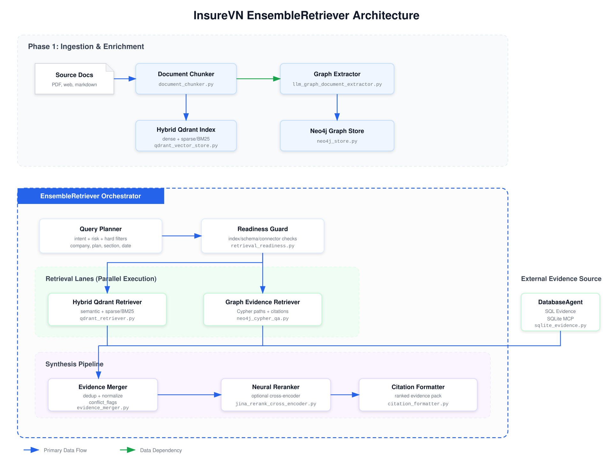
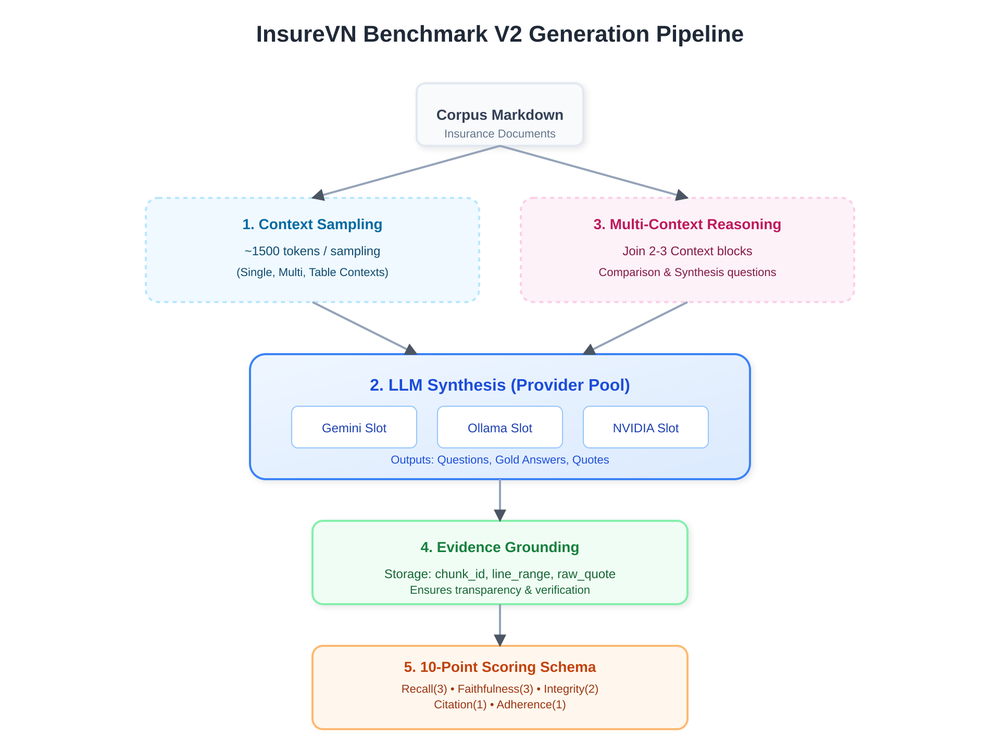

<p align="center">
  <a href="README.md"><b>Tiếng Việt</b></a> | <a href="docs/README.en.md">English</a>
</p>

<p align="center">
  
</p>

<h1 align="center">InsureVN: Hybrid Full-Agent Swarm Platform</h1>

<p align="center">
  <b>Nền tảng Multi-Agent Swarm tối ưu hóa quy trình bảo hiểm Việt Nam dựa trên bằng chứng tri thức minh bạch</b>
</p>

<p align="center">
  
  
  
  
  <br>
  
  
  
  
</p>

<p align="center">
  <a href="#-tính-năng-cốt-lõi">Tính năng</a>  · 
  <a href="#-kiến-trúc-hệ-thống-system-architecture">Kiến trúc</a>  · 
  <a href="#-quy-trình-xử-lý-dữ-liệu-data-pipeline">Data Pipeline</a>  · 
  <a href="#-chunking-mastery">Chunking</a>  · 
  <a href="#-production-infrastructure">Infrastructure</a>  · 
  <a href="#-roadmap--trạng-thái-phát-triển">Roadmap</a>  · 
  <a href="CHANGELOG.md">Changelog</a>
</p>

---

### 📢 Tin tức mới (Latest News)

- **[09/05/2026]** 📊 **Optimization Decision**: Sau khi đánh giá 9 chiến lược, hệ thống chính thức áp dụng `hierarchical_header_recursive` với cấu hình `900/150` tokens để đạt recall cao nhất.
- **[08/05/2026]** 🗄️ **Data Scale Milestone**: Hoàn tất nạp dữ liệu từ 83 tài liệu gốc, trích xuất **7,004 bệnh viện**, **3,766 quyền lợi** và **1,771 biểu phí** vào SQLite qua FastMCP.
- **[07/05/2026]** ⚖️ **LLM-as-a-Judge**: Hoàn thành chấm điểm tự động cho 1,350 trường hợp truy xuất bằng pool LLM đa nguồn (Gemini, NVIDIA, Ollama).
- **[06/05/2026]** 🎯 **Automated Ground Truth**: Triển khai quy trình tạo tập dữ liệu kiểm thử tự động dựa trên cấu trúc tài liệu (H1/H2) và Keyword Extraction.
- **[05/05/2026]** 🕸️ **KG Automation**: Tự động hóa việc khám phá (Discover) và chuẩn hóa (Canonicalize) Schema cho Knowledge Graph từ dữ liệu Markdown.
- **[04/05/2026]** 🧠 **Gemma4 Fine-tuned**: Huấn luyện thành công mô hình Vision-Language (VLM) chuyên biệt cho việc trích xuất bảng biểu bảo hiểm Việt Nam.
- **[03/05/2026]** 🏗️ **Quad-Retrieval**: Phê duyệt thiết kế kiến trúc 4 tầng (Vector + BM25 + Graph + SQL) nhằm triệt tiêu hoàn toàn Hallucination.

<details>
<summary>Tin tức cũ hơn</summary>

- **2026-05-02** 📑 **Table-to-Text & MCP Integration**: Tích hợp công cụ chuyển đổi bảng biểu sang văn bản tự sự và kết nối Database Agent với SQLite MCP Server.
- **2026-05-01** 🏷️ **JSON Classification Pipeline**: Hoàn thiện quy trình phân loại và trích xuất dữ liệu có cấu trúc từ tài liệu bảo hiểm.
- **2026-04-28** 📄 **Document AI Pipeline**: Khởi động chiến lược xây dựng pipeline xử lý tài liệu bảo hiểm thông minh (PDF-to-AI-ready).

</details>

---

## 💡 Tầm nhìn & Sứ mệnh (Vision)

> **"Thứ khó nhất không phải là Prompt, mà là Production Infrastructure."**

InsureVN không phải là một chatbot RAG đơn thuần, mà là một **Nền tảng Tác vụ thông minh (Agent Swarm Platform)** với hạ tầng tri thức tri-canonical, nơi mọi câu trả lời của AI đều có thể truy vết ngược lại tài liệu gốc với độ chính xác tuyệt đối.

---

## ✨ Tính năng cốt lõi

### 🌟 Tính năng nổi bật (Core Features)

- **✅ Hệ thống Quad-Retrieval Engine**: Kết hợp Vector (Qdrant), BM25, Graph (NetworkX) và SQL (SQLite) để triệt tiêu Hallucination. [Xem thiết kế](docs/architecture/2026-05-04-quad-retrieval-rag-architecture.md)
- **✅ [Pipeline 6 giai đoạn](docs/work_log/2026-05-09-work-history-technical-report.md)**: Quy trình xử lý dữ liệu bảo hiểm tự động từ PDF thô sang tri thức có cấu trúc.
- **✅ Benchmark V2 & Evaluation**: Hệ thống đánh giá chunking và retrieval tự động với bộ chỉ số chính xác cao.
- **🚧 Hybrid Agent Swarm (In Dev)**: Hệ thống đa tác vụ (Supervisor, Policy, Claim, Advisor...) đang được tích hợp qua LangGraph.
- **✅ Observability**: Giám sát toàn bộ luồng suy luận và hiệu suất hệ thống qua Langfuse.
- **✅ Document Extraction**: Công nghệ Table-to-Narrative giúp AI hiểu 100% các bảng biểu bảo hiểm phức tạp.

---

## 🏗️ Kiến trúc Hệ thống (System Architecture)

Dự án áp dụng mô hình **Hybrid Full Agent Swarm**, được điều phối bởi LangGraph để đảm bảo tính tin cậy cao nhất qua Quad-Retrieval Engine.

<p align="center">
  
</p>

### 🤖 Đội ngũ Agent Swarm

| Agent                 | Nhiệm vụ chính (Trạng thái thiết kế)                                                               |
| :-------------------- | :------------------------------------------------------------------------------ |
| **Supervisor**  | Phân loại ý định, đánh giá rủi ro và điều hướng luồng. (Design ✅) |
| **Policy**      | Chuyên gia phân tích văn bản điều khoản pháp lý. (Design ✅) |
| **Comparison**  | Chuyên gia so sánh sản phẩm và tư vấn cá nhân hóa. (Design ✅) |
| **Claim**       | Xử lý nghiệp vụ bồi thường và dự thảo phản hồi. (Design ✅) |
| **Validation**  | "Thẩm phán" thực hiện kiểm chứng chéo (Blind Review). (Design ✅) |
| **Calculation** | Thực hiện tính toán số học xác định (Deterministic). (Design ✅) |
| **Verifier**    | Kiểm soát an toàn, tuân thủ và độ đầy đủ của trích dẫn. (Design ✅) |

> [!NOTE]
> Các Agent trên hiện đang trong quá trình tích hợp vào luồng LangGraph. Xem chi tiết tại [Platform Design](docs/architecture/2026-05-03-multi-agent-platform-design.md).

### Quy trình 4 tầng truy vấn (Quad-Retrieval)

| Phương thức             | Công nghệ | Vai trò trong InsureVN                                                       |
| :------------------------- | :---------- | :---------------------------------------------------------------------------- |
| **Vector Search**    | Qdrant      | Tìm kiếm ngữ nghĩa, hiểu ngữ cảnh câu hỏi của người dùng.        |
| **Keyword Search**   | BM25        | Trích xuất chính xác tên bệnh, thuốc và các thuật ngữ pháp lý.   |
| **Graph Retrieval**  | Neo4j       | Suy luận quan hệ đa tầng (Entity-Relationship) giữa các điều khoản.  |
| **Structured Query** | SQLite      | Truy xuất con số chính xác về phí, hạn mức và danh mục bệnh viện. |
| **Search Agent**     | Tavily      | Tìm kiếm thông tin thị trường thời gian thực (Optional Tool).      |


### 🧠 Chi tiết luồng Ensemble Retriever (Quad-Retrieval)

Hệ thống sử dụng cơ chế **EnsembleRetriever** để điều phối 4 luồng truy vấn song song, đảm bảo tính đầy đủ và chính xác của bằng chứng trước khi tổng hợp câu trả lời.

<p align="center">
  
</p>

- **Giai đoạn 1: Ingestion & Enrichment**: Tài liệu được chia nhỏ (Chunking) và đánh chỉ số đồng thời vào Qdrant (Dense + Sparse) và Neo4j (Graph).
- **Giai đoạn 2: Orchestration**: Query Planner phân tích ý định và áp dụng Hard Filters trước khi kích hoạt các Retriever Lanes.
- **Giai đoạn 3: Parallel Execution**: Thực thi song song truy vấn Vector, Keyword, Graph và SQL (qua DatabaseAgent).
- **Giai đoạn 4: Fusion & Reranking**: Hợp nhất bằng chứng, khử trùng lặp và xếp hạng lại bằng Cross-Encoder (Jina Rerank) trước khi trích dẫn.

> [!IMPORTANT]
> Xem chi tiết tại: [Quad-Retrieval RAG Architecture](docs/architecture/2026-05-04-quad-retrieval-rag-architecture.md) và [Ensemble Retriever Log](docs/work_log/2026-05-09-ensemble-retriever-flow-technical-report.md).


### 📚 Cơ sở hạ tầng Tri thức (Tri-Canonical Knowledge Base)

Hệ thống duy trì sự nhất quán tri thức qua 3 kênh lưu trữ chuyên biệt:
- **SQLite (Structured Facts):** Lưu trữ 100% các con số "cứng" (**7,004 bệnh viện**, **3,766 quyền lợi**, **1,771 biểu phí**). Truy vấn qua **FastMCP Server** với [15+ công cụ nghiệp vụ](docs/database/mcp_insurevn_db_reference.md). [Chi tiết Schema](docs/database/sqlite_database_schema_specification.md).
- **Qdrant (Document Context):** Lưu trữ hàng chục ngàn đoạn văn bản (chunks) từ **83 tài liệu bảo hiểm** gốc, hỗ trợ tìm kiếm Hybrid (Dense + Sparse).
- **Knowledge Graph (NetworkX/Neo4j):** Bản đồ hóa các mối liên kết thực thể (Entity-Relationship) giữa Công ty → Gói bảo hiểm → Điều khoản loại trừ.


### 🕸️ Quy trình xây dựng Knowledge Graph

Quy trình tự động hóa từ việc khám phá Schema đến xây dựng và kiểm định đồ thị tri thức, đảm bảo các mối quan hệ giữa các điều khoản bảo hiểm được ánh xạ chính xác.

<p align="center">
  
</p>

1. **Discover Schema**: LLM tự động nhận diện các thực thể (Entity) và quan hệ (Relationship) tiềm năng từ văn bản.
2. **Clean Schema**: Chuẩn hóa thực thể (Canonicalization) và loại bỏ các quan hệ nhiễu để tạo ra Schema Contract.
3. **Build Graph**: Trích xuất tri thức thực tế từ tài liệu và xây dựng đồ thị (Graph JSON/Neo4j).
4. **Validate & Save**: Kiểm tra chất lượng (Quality Report), tính toàn vẹn của trích dẫn và lưu trữ vào Production DB.

> [!IMPORTANT]
> Xem chi tiết tại: [Knowledge Graph Schema Discovery & Pipeline](docs/architecture/2026-05-09-knowledge-graph-schema-discovery-pipeline.md).


---

## ⚙️ Quy trình xử lý dữ liệu (Data Pipeline)

| Giai đoạn                | Chi tiết Vận hành (Runbooks)                                                                 | Hành động & Kết quả                                             |
| :------------------------- | :-------------------------------------------------------------------------------------------- | :------------------------------------------------------------- |
| **1. Acquisition & Pre**   | [Chi tiết Phẫu thuật PDF](docs/pipeline/pdf_acquisition_and_preprocessing.md)                  | Crawl, lọc nhiễu và tổ chức kho PDF bảo hiểm thô.              |
| **2. Conversion & Clean**  | [Chi tiết Chuyển đổi Markdown](docs/pipeline/document_conversion_and_markdown_cleanup.md)      | PDF -> Markdown & Narrative Table (Bảng biểu tự sự).           |
| **3. Extraction & Visual** | [Chi tiết Trích xuất VLM](docs/pipeline/visual_extraction_and_json_mapping.md)                | OCR/VLM trích xuất JSON cấu trúc và mapping SQLite Schema.     |
| **4. Training & Eval**     | [Chi tiết Huấn luyện & Đánh giá](docs/pipeline/vlm_training_and_rag_evaluation.md)            | Fine-tune Gemma/Qwen và sinh Benchmark V2 cho RAG.              |
| **5. Ingest & Indexing**   | [Chi tiết Nạp dữ liệu](docs/pipeline/sqlite_qdrant_graph_ingestion.md)                         | Indexing vào Vector (Qdrant) & Graph DB (Neo4j).                |
| **6. Ops & Debugging**     | [Chi tiết Công cụ Vận hành](docs/pipeline/operations_and_review_tools.md)                      | Review UI, Langfuse Trace và Smoke Testing Search Tool.         |

> [!TIP]
> Xem toàn bộ bản đồ năng lực vận hành tại: [Script Capability Runbooks](docs/pipeline/README.md).

---

## 🧩 Chunking Mastery

### So sánh & Đánh giá (Evaluation)

Chúng tôi sử dụng hệ thống đánh giá tự động chuyên sâu để so sánh các chiến lược chunking, tập trung vào khả năng truy xuất bằng chứng (Evidence Retrieval).

- **Chiến lược tối ưu:** `hierarchical_header_recursive` (Phân tách theo cấp bậc tiêu đề và đệ quy) được xác định là phương pháp hiệu quả nhất cho các văn bản bảo hiểm phức tạp.
- **Cấu hình chuẩn:** Kích thước chunk **900 tokens** với độ chồng lấp (overlap) **150 tokens** mang lại recall tốt nhất trên tập dữ liệu thực tế.
- **Bộ chỉ số đánh giá:**
  - **Retrieval:** Hit@5 (Primary), MRR@5, Required Source Recall và Line Overlap Recall.
  - **Quality:** Redundancy ratio, Mid-sentence cut ratio, Table/Heading integrity.

#### Kết quả Benchmark V2 (Ranking)

| Rank | Strategy | Primary hit@5 | MRR@5 | Required source recall@5 | Line overlap recall@5 |
| ---: | --- | ---: | ---: | ---: | ---: |
| 1 | `hierarchical_header_recursive` | 0.6200 | 0.3973 | 0.6200 | 0.2183 |
| 2 | `table_as_one_hybrid` | 0.6000 | 0.4222 | 0.6000 | 0.1900 |
| 3 | `markdown_then_semantic` | 0.5700 | 0.4148 | 0.5700 | 0.1050 |
| 4 | `markdown_header_recursive_table` | 0.5300 | 0.3602 | 0.5300 | 0.1350 |
| 5 | `semantic_embedding` | 0.5300 | 0.3365 | 0.5300 | 0.1183 |

#### Hiệu suất theo loại câu hỏi (Case-Type)

| Case type | Best strategy | Line overlap recall@5 | Required source recall@5 |
| --- | --- | ---: | ---: |
| `single_context` | `hierarchical_header_recursive` | 0.4667 | 0.8000 |
| `two_context` | `llm_markdown_optimal` | 0.1333 | 0.4333 |
| `three_context` | `semantic_embedding` | 0.1111 | 0.5667 |
| `table_context` | `table_as_one_hybrid` | 0.2000 | 0.7000 |

> [!TIP]
> Xem chi tiết báo cáo đánh giá mới nhất (Benchmark V2) tại: [Context Benchmark V2 Report](docs/work_log/2026-05-09-context-benchmark-v2-all-chunking-eval-technical-report.md)

### Tự động tạo Ground Truth (Benchmark V2)

InsureVN triển khai quy trình tạo tập dữ liệu kiểm thử tự động V2 (Benchmark V2) sử dụng LLM để thay thế phương pháp TF-IDF cũ, giúp đánh giá RAG chuyên sâu hơn:

1. **Context Sampling:** Tự động lấy mẫu các khối văn bản lớn (~1500 tokens) từ corpus, đảm bảo bao phủ đầy đủ các kịch bản (single-context, multi-context, table-context).
2. **LLM Synthesis:** Sử dụng pool LLM slot (Gemini, Ollama, NVIDIA...) để tự động hóa việc tạo câu hỏi (Question), câu trả lời vàng (Gold Answer) và trích dẫn (Evidence Quotes).
3. **Multi-Context Reasoning:** Tự động ghép nối 2-3 ngữ cảnh từ cùng một tài liệu để tạo ra các câu hỏi so sánh và tổng hợp, kiểm tra khả năng suy luận phức tạp của Agent.
4. **Evidence Grounding:** Đối soát và lưu trữ chính xác `chunk_id`, `line_range` và copy nguyên văn trích dẫn để đảm bảo tính minh bạch của bằng chứng.
5. **10-Point Scoring Schema:** Đánh giá chi tiết dựa trên 5 tiêu chí: Retrieval Recall (3), Answer Faithfulness (3), Evidence Integrity (2), Citation Correctness (1) và Context Adherence (1).
6. **Benchmark V2 Generation Pipeline Diagram**:

<p align="center">
  
</p>

> [!NOTE]
> Xem chi tiết logic tạo benchmark tại: [Benchmark V2 Generation Logic](docs/architecture/2026-05-09-benchmark-v2-generation-logic-technical-report.md)

### 📚 Cơ sở khoa học (Scientific Foundation)

Kiến trúc của InsureVN được xây dựng dựa trên các nghiên cứu hàng đầu về RAG và Chunking:
- **Adaptive Chunking (LREC 2026):** [Optimizing Chunking-Method Selection for RAG](https://arxiv.org/pdf/2603.25333).
- **LightRAG Pattern:** Sử dụng Dual-level Graph Retrieval để tăng cường tính liên kết của tri thức.
- **NVIDIA Research:** [Finding the Best Chunking Strategy for Accurate AI Responses](https://developer.nvidia.com/blog/finding-the-best-chunking-strategy-for-accurate-ai-responses/).

---

## 🏗️ Production Infrastructure

Dự án đối mặt với thách thức lớn nhất: **Maintenance Nightmare** (Sự thay đổi chóng mặt của AI Stack). Chúng tôi giải quyết bằng một hạ tầng vững chắc:

- **Observability & Monitoring:** Tích hợp **Langfuse** để theo dõi Telemetry, Latency, Throughput và Cost Tracking cho từng yêu cầu.
- **Human-in-the-loop:** Cơ chế **Human Approval** cho các luồng rủi ro cao (Bồi thường/Chi trả).
- **Quality Gates:** Hệ thống **Eval & Guardrails** tự động kiểm tra tính an toàn và trung thực của câu trả lời trước khi gửi tới người dùng.
- **Reliability:** Triển khai cơ chế **Retries**, **Queue** xử lý bất đồng bộ và **Caching** để giảm thiểu chi phí API.
- **DevOps:** Quy trình **CI/CD** tự động, quản lý **Secrets** nghiêm ngặt và kiến trúc sẵn sàng cho việc **Scaling**.

---

## 🗺 Roadmap & Trạng thái phát triển

Dự án được triển khai theo 8 giai đoạn (Phases) chiến lược, từ hạ tầng dữ liệu đến Swarm tự trị:

### ✅ Giai đoạn nền tảng (Completed)
- [x] **[Phase 00: Project Bootstrap](docs/blueprints/phase_00_project_bootstrap_and_api_foundation.md)**:
    - [x] Khởi tạo FastAPI & Uvicorn runtime.
    - [x] Cấu hình Typed Settings (Pydantic).
    - [x] Hệ thống Structured JSON Logging & Langfuse integration.
- [x] **[Phase 01: Evidence Foundation](docs/blueprints/phase_01_evidence_foundation.md)**:
    - [x] Định nghĩa Universal Evidence Model & Citation lineage.
    - [x] Xây dựng Evidence Merger (Deduplication & Conflict Detection).
    - [x] Chuẩn hóa dữ liệu đầu ra cho các Agent.
- [x] **[Phase 02: Qdrant Document Retrieval](docs/blueprints/phase_02_qdrant_document_retrieval.md)**:
    - [x] Triển khai Hybrid Search (Dense Vector + Sparse/BM25).
    - [x] Hệ thống Parent-Child Chunking cho tài liệu bảo hiểm.
    - [x] Tối ưu hóa Hard-filters cho Company/Product/Plan.
- [x] **[Phase 06: Evaluation Harness (Part 1)](docs/blueprints/phase_06_synthetic_dataset_eval_harness.md)**:
    - [x] Xây dựng tập Benchmark V2 (100+ kịch bản thực tế).
    - [x] LLM-guided context sampling & automated ground-truth generation.
    - [x] Đánh giá so sánh 5+ chiến lược Chunking chuyên sâu.

### 🚧 Giai đoạn triển khai (Ongoing)
- [ ] **[Phase 03: Knowledge Graph Foundation](docs/blueprints/phase_03_knowledge_graph_foundation.md)**:
    - [x] Automated Schema Discovery (Khám phá thực thể & quan hệ).
    - [x] Entity Canonicalization (Chuẩn hóa thực thể từ văn bản thô).
    - [ ] Xây dựng NetworkX/Neo4j Graph cho quan hệ đa tầng (Plan -> Excludes -> Condition).
- [ ] **[Phase 04: Supervisor Routing Graph](docs/blueprints/phase_04_supervisor_routing_graph.md)**:
    - [x] SupervisorAgent: Phân loại Intent & Đánh giá mức độ rủi ro (Risk Level).
    - [ ] Cơ chế Dynamic Workflow Selection (Fast Lane vs High-Risk Lane).
    - [ ] Quản lý trạng thái LangGraph (Checkpointer & Thread ID).
- [ ] **[Phase 06: Evaluation Harness (Part 2)](docs/blueprints/phase_06_synthetic_dataset_eval_harness.md)**:
    - [ ] Đánh giá E2E cho luồng suy luận của Agent Swarm.
    - [ ] Langfuse Trace scoring & Answer Faithfulness evaluation.

### 🎯 Giai đoạn nâng cao (Planned)
- [ ] **[Phase 05: Specialist Workflows](docs/blueprints/phase_05_specialist_workflows.md)**:
    - [ ] **PolicyAgent**: Chuyên gia giải thích điều khoản & trích dẫn văn bản.
    - [ ] **ComparisonAdvisorAgent**: So sánh sản phẩm & tư vấn cá nhân hóa (Personalized Advisor).
    - [ ] **ClaimAgent**: Dự thảo quyết định bồi thường & giải thích từ chối.
    - [ ] **CalculationAgent**: Thực hiện tính toán số học (Premiums/Payouts) bằng code Python thuần.
- [ ] **[Phase 07: HITL Operational Review](docs/blueprints/phase_07_hitl_operational_review.md)**:
    - [ ] Cổng xác nhận thực tế (Customer Confirm) trước khi xử lý.
    - [ ] Cổng phê duyệt nhân viên (Employee Approve) cho các luồng chi trả cao.
    - [ ] LangGraph Breakpoint & Resume mechanism cho quy trình dài hạn.
- [ ] **Hạ tầng Production & Tối ưu**:
    - [ ] Tích hợp Jina Reranker cho giai đoạn Fusion & Reranking.
    - [ ] Triển khai Caching & Queue xử lý bất đồng bộ.
    - [ ] Xây dựng User Profile Store dựa trên dữ liệu tổng hợp (Synthetic Data).

---

## 📁 Cấu trúc dự án (Project Structure)

<details>
<summary><b>Click để xem chi tiết cấu trúc thư mục</b></summary>

```text
InsureVN/
├── src/                    # Mã nguồn lõi
│   ├── agents/             # Logic điều phối các Agent
│   ├── services/           # Dịch vụ xử lý (Retrieval, Evidence, Graph)
│   ├── tools/              # Các công cụ bổ trợ (Search, MCP)
│   └── models/             # Định nghĩa Schema dữ liệu
├── scripts/                # Data Pipeline & Evaluation scripts
├── docs/                   # Tài liệu thiết kế, ADR & Work Logs
├── tests/                  # Hệ thống kiểm thử (Unit, Integration, E2E)
├── database/               # File cơ sở dữ liệu local (SQLite)
├── data/                   # Dữ liệu bảo hiểm (Raw, Processed)
└── asset/                  # Hình ảnh kiến trúc và tài sản dự án
```

</details>

---

<p align="center">
  Cảm ơn bạn đã ghé thăm <b>InsureVN</b> ✨
</p>
