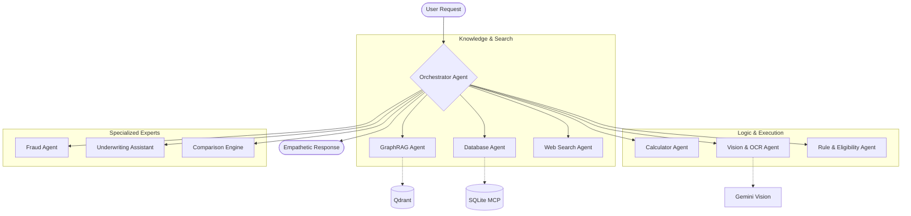

# InsureVN 🛡️ — AI-Powered Multi-Agent Insurance Ecosystem

[](https://www.python.org/downloads/release/python-3120/)
[](https://python.langchain.com/)
[](https://deepmind.google/technologies/gemini/)
[](https://qdrant.tech/)

**InsureVN** is a production-grade, multi-agent AI system designed to automate and optimize the full insurance lifecycle for the Vietnamese market. By transforming complex, unstructured policy documents into actionable intelligence, InsureVN bridges the gap between insurance providers and customers.

---

## 🚀 Core Mission

Insurance in Vietnam faces three critical challenges:

1. **Impenetrable Legal Language**: Policy documents are often 50+ pages of complex jargon.
2. **Fragmented Processes**: Claiming is manual, slow, and prone to error or fraud.
3. **Unstructured Data**: 90% of insurance intelligence is trapped in PDFs and images.

**InsureVN solves this by:**

- 🧠 **Simplifying**: Explaining complex clauses in plain Vietnamese.
- ⚡ **Automating**: Extracting structured data from medical bills and IDs in seconds.
- 🛡️ **Protecting**: Detecting fraud and identifying "gotcha" clauses before they affect users.

---

## 🏗️ System Architecture

InsureVN utilizes a **Hierarchical Swarm Architecture** powered by **LangGraph**. A central Orchestrator delegates tasks to specialized expert agents.



### Key Agents

- **Orchestrator**: The central brain that routes queries and synthesizes final answers.
- **DatabaseAgent**: A specialized agent that translates natural language into complex SQLite queries via **MCP tools**.
- **PolicyAgent**: Uses RAG over Qdrant to explain specific policy clauses.
- **ClaimAgent**: Evaluates eligibility and guides users through the submission process.
- **DocumentAgent**: High-fidelity OCR and structured data extraction (PII-aware).
- **FraudAgent**: Detects suspicious patterns in claim history and documents.

---

## 🛠️ Technology Stack

| Layer                   | Technology                                         |
| :---------------------- | :------------------------------------------------- |
| **Language**      | Python 3.12.3                                      |
| **Orchestration** | LangChain, LangGraph                               |
| **LLM Models**    | Google Gemini (Pro/Flash/Vision), Gemma-4          |
| **Vector DB**     | Qdrant (Knowledge Base)                            |
| **Relational DB** | SQLite (User Profiles, Payouts, Hospital Networks) |
| **Observability** | Langfuse (Tracing, Prompt Mgmt, Evaluation)        |
| **Extraction**    | Firecrawl (Acquisition), Vision LLMs (OCR)         |
| **API**           | FastAPI                                            |

---

## 🚦 Getting Started

### Prerequisites

- Python 3.12.3
- SQLite 3
- [Optional] Docker (for Qdrant & Langfuse)

### Installation

1.  **Clone the repository**:
    ```bash
    git clone https://github.com/quangnhvn34/InsureVN.git
    cd InsureVN
    ```

2.  **Install dependencies**:
    ```bash
    pip install -e ".[dev]"
    ```

3.  **Configure environment**:
    ```bash
    cp .env.example .env  # Update with your API keys
    ```

### Developer Commands

| Task | Command |
| :--- | :--- |
| **Start API** | `uvicorn src.main:app --reload` |
| **Run Tests** | `pytest` |
| **Check Lint** | `ruff check src tests` |
| **Auto Format** | `ruff format src tests` |
| **Check Health** | `curl http://localhost:8000/health` |

---

## 🏗️ Infrastructure & Observability

InsureVN is built for production reliability with a comprehensive observability and operations stack:

- **Database MCP**: A dedicated Model Context Protocol server for **SQLite**, providing secure, schema-aware tools for agents.
- **Observability (Langfuse)**: Full-lifecycle tracing of agent chains, remote prompt versioning, and user feedback collection.
- **AI Review Tool**: A custom FastAPI dashboard (`scripts/review_tool.py`) for human-in-the-loop validation of AI extraction results.
- **Structured Logging**: Centralized JSON-based logging with rotation, ensuring all agent actions and errors are traceable.

---

## 📊 Data Pipeline (ETL)

InsureVN features a robust pipeline that converts raw insurance documents into a queryable relational database.

1. **Acquisition**: `scripts/01_acquisition/` — Scraping and collection via Firecrawl.
2. **Extraction**: `scripts/04_extraction/` — OCR and Vision-to-JSON extraction using LLMs.
3. **Classification**: `scripts/04_extraction/11_llm_schema_mapping.py` — Dynamic key-set classification.
4. **Ingestion**: `scripts/06_db_ingestion/02_ingest_with_mapping.py` — Normalizing and loading into SQLite.
5. **Review**: `scripts/review_tool.py` — Human-in-the-loop verification of extraction quality.

---

## 🗺️ Project Roadmap & Current Progress

### Phase 1: Data Acquisition (Done ✅)

- [X] Multi-site PDF scrapers (AIA, Pacific Cross, BIC, etc.)
- [X] **Firecrawl** integration for deep web crawling.
- [X] Automated document download and tracking.

### Phase 2: Preprocessing & Organization (Done ✅)

- [X] **Ollama-based** PDF classification (Policy vs. Brochure vs. Pricing).
- [X] Automated folder hierarchy organization.
- [X] PDF-to-Markdown conversion using **Marker** and **Datalab**.

### Phase 3: AI Extraction Engine (Done ✅)

- [X] Vision LLM table extraction (Gemma-4).
- [X] **LLM Schema Mapping**: Handling heterogeneous JSON keys across 6 companies.
- [X] "Good vs. Trash" content classifier to filter OCR noise.
- [X] **Gemma-4 Fine-tuning**: Custom VLM finetune for Vietnamese insurance tables.
- [X] **Human-in-the-loop Review Tool**: UI for verifying extraction pdf accuracy,

### Phase 4: Structured Knowledge Base (Done ✅)

- [X] **SQLite Design**: Normalized schema for benefits, premiums, and networks.
- [X] **Relational Ingestion**: Automated mapping of 600+ JSON tables to SQLite.
- [X] Data lineage tracking from DB back to original JSON/PDF.

### Phase 5: Multi-Agent Intelligence (In Progress 🚧)

- [X] **DatabaseAgent**: Complex SQLite query execution via custom MCP tools.
- [X] **Observability Stack**: Langfuse integration for tracing, prompt management, and evaluation.
- [X] **SQLite MCP Server**: Dedicated MCP server for secure and structured database interaction.
- [ ] **Orchestrator**: LangGraph-based central router.
- [ ] **PolicyAgent**: RAG-based explanation engine over Qdrant.
- [ ] **ClaimAgent**: Eligibility and payout calculation logic.
- [ ] **FraudAgent**: Pattern-based fraud detection.

---

## 📁 Project Structure

```text
InsureVN/
├── src/                     # Core Source Code
│   ├── agents/               # LangGraph agent definitions (DatabaseAgent, etc.)
│   ├── mcp_servers/          # Custom MCP server implementations (SQLite)
│   ├── tools/                # Reusable tools & MCP clients
│   ├── api/                  # FastAPI routes & dependencies
│   ├── models/               # Pydantic models & SQL schemas
│   ├── core/                 # Configuration, logging, & database utilities
│   └── prompts/              # System prompts (managed via Langfuse)
├── scripts/                 # ETL Pipeline, Research & Tools
│   ├── 01_acquisition/      # Scraping (Firecrawl)
│   ├── 04_extraction/       # OCR & Data Extraction
│   ├── 06_db_ingestion/     # SQLite Loading
│   └── review_tool.py       # AI Extraction Reviewer UI
├── docs/                    # Technical Documentation & Reports
├── database/                # SQLite database files
├── data/                    # Raw/Processed JSON/PDF data
└── tests/                   # Unit, Integration, and E2E tests
```

---

---

## 📖 Documentation Index

For deeper technical insights, please refer to the `docs/` directory:

- [Architecture Design](docs/multi_agent_system_architecture_design.md)
- [Database Schema Specification](docs/sqlite_database_schema_specification.md)
- [Insurance Lifecycle Solutions](docs/insurance_lifecycle_ai_solutions_mapping.md)
- [100 Customer Intent Scenarios](docs/customer_intent_scenarios_100_questions.md)

---

## 🛡️ License

© 2026 InsureVN Team. All rights reserved. Built with ❤️ for the Vietnamese Insurance Community.
