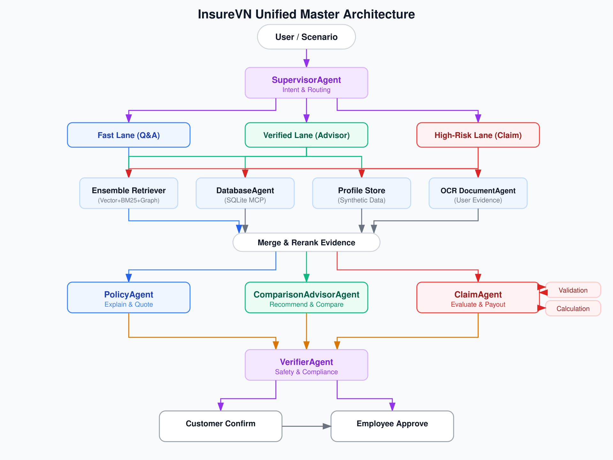

<p align="center">
  
</p>

<h1 align="center">InsureVN</h1>

<p align="center">
  Nền tảng bằng chứng multi-agent cho nghiệp vụ bảo hiểm sức khỏe Việt Nam.
</p>

<p align="center">
  
  
  
  
</p>

InsureVN là nền tảng AI cho nghiệp vụ bảo hiểm sức khỏe Việt Nam. Dự án tập
trung vào một nền tảng bằng chứng chung: dữ liệu có cấu trúc trong SQLite,
ngữ cảnh văn bản trong Qdrant, quan hệ thực thể trong Knowledge Graph, và các
agent LangGraph/LangChain sử dụng bằng chứng đó để giải thích điều khoản, so
sánh quyền lợi và hỗ trợ quy trình claim.

README này là bản đồ kỹ thuật cấp cao. Chi tiết triển khai, benchmark và nhật
ký công việc nằm trong `docs/`.

## Mục Lục

- [Tổng Quan Kỹ Thuật](#technical-snapshot)
- [Năng Lực Đã Triển Khai](#implemented-capabilities)
- [Kiến Trúc](#architecture)
- [Nền Tảng Dữ Liệu Và Bằng Chứng](#data-and-evidence-foundation)
- [Data Pipeline](#data-pipeline)
- [Tóm Tắt Đánh Giá](#evaluation-snapshot)
- [Chạy Cục Bộ](#running-locally)
- [Trạng Thái Hiện Tại](#current-status)
- [Bản Đồ Tài Liệu](#documentation-map)

## Tổng Quan Kỹ Thuật <a id="technical-snapshot"></a>

| Khu vực | Trạng thái hiện tại | Bằng chứng |
| :--- | :--- | :--- |
| Runtime | FastAPI app factory, endpoint `/health`, structured request logging | [`src/main.py`](src/main.py), [`src/api/routes/health.py`](src/api/routes/health.py) |
| Ngôn ngữ và dependency | Python `>=3.12.3`; FastAPI, LangChain, LangGraph, Deep Agents, Qdrant, Neo4j, Langfuse | [`pyproject.toml`](pyproject.toml), [`requirements.txt`](requirements.txt) |
| Dữ liệu có cấu trúc | SQLite có 6 công ty, 83 tài liệu, 644 source tables, 3,766 benefit values, 1,771 premium rows, 7,004 bệnh viện/phòng khám | [`database/insurevn.db`](database/insurevn.db), [`docs/database/sqlite_database_schema_specification.md`](docs/database/sqlite_database_schema_specification.md) |
| Agent truy cập dữ liệu | FastMCP SQLite server và `DatabaseAgent` wrapper trên LangChain tools | [`src/mcp_servers/sqlite/server.py`](src/mcp_servers/sqlite/server.py), [`src/agents/database_agent.py`](src/agents/database_agent.py) |
| Evidence model | `Evidence`, `Citation`, retrieval plan, risk và workflow schemas dùng chung | [`src/models/evidence.py`](src/models/evidence.py) |
| Retrieval services | Qdrant vector store/retriever, evidence adapters, merger, reranker, readiness checks | [`src/services/`](src/services/) |
| Knowledge Graph | Graph schema, extraction, quality validation, NetworkX builder, Neo4j store/Cypher QA helpers | [`src/services/knowledge_graph/`](src/services/knowledge_graph/), [`docs/architecture/2026-05-09-knowledge-graph-schema-discovery-pipeline.md`](docs/architecture/2026-05-09-knowledge-graph-schema-discovery-pipeline.md) |
| Evaluation | Chunking, Qdrant indexing, persisted retrieval eval, Benchmark V2, LLM judge runners | [`src/eval/`](src/eval/), [`scripts/05_training_eval/`](scripts/05_training_eval/) |
| Hạ tầng local | Qdrant và Neo4j local qua Docker Compose | [`CICD/docker-compose.yml`](CICD/docker-compose.yml) |

## Năng Lực Đã Triển Khai <a id="implemented-capabilities"></a>

| Năng lực | Trạng thái | Bằng chứng |
| :--- | :--- | :--- |
| API bootstrap và health check | Đã triển khai | [`src/main.py`](src/main.py), [`tests/integration/test_health_api.py`](tests/integration/test_health_api.py) |
| Typed settings và provider routing | Đã triển khai, có override theo component | [`src/core/config.py`](src/core/config.py), [`.env.example`](.env.example) |
| SQLite insurance schema và MCP tools | Đã triển khai | [`src/models/schema.sql`](src/models/schema.sql), [`docs/database/mcp_insurevn_db_reference.md`](docs/database/mcp_insurevn_db_reference.md) |
| `DatabaseAgent` trên SQLite MCP | Đã triển khai | [`src/agents/database_agent.py`](src/agents/database_agent.py), [`tests/unit/test_database_agent.py`](tests/unit/test_database_agent.py) |
| Evidence merge và citation utilities | Đã triển khai | [`src/services/evidence_merger.py`](src/services/evidence_merger.py), [`src/services/citation_formatter.py`](src/services/citation_formatter.py) |
| Qdrant retrieval và indexing services | Đã triển khai dạng service; chất lượng runtime phụ thuộc indexed collection và cấu hình embedding | [`src/services/qdrant_retriever.py`](src/services/qdrant_retriever.py), [`scripts/06_db_ingestion/04_index_qdrant_documents.py`](scripts/06_db_ingestion/04_index_qdrant_documents.py) |
| Knowledge Graph discovery/build pipeline | Đã triển khai dạng scripts và services; workflow graph end-to-end vẫn đang được hoàn thiện | [`scripts/07_knowledge_graph/`](scripts/07_knowledge_graph/), [`tests/unit/test_knowledge_graph_builder.py`](tests/unit/test_knowledge_graph_builder.py) |
| Chunking benchmark và retrieval evaluation | Đã triển khai và đã dùng cho Benchmark V2 | [`src/eval/README.md`](src/eval/README.md), [`docs/work_log/2026-05-09-context-benchmark-v2-all-chunking-eval-technical-report.md`](docs/work_log/2026-05-09-context-benchmark-v2-all-chunking-eval-technical-report.md) |
| Hybrid full-agent swarm | Kiến trúc canonical đã có; specialist workflows end-to-end đang triển khai | [`docs/architecture/2026-05-03-multi-agent-platform-design.md`](docs/architecture/2026-05-03-multi-agent-platform-design.md), [`docs/blueprints/phase_05_specialist_workflows.md`](docs/blueprints/phase_05_specialist_workflows.md) |

## Kiến Trúc <a id="architecture"></a>

Thiết kế canonical là Hybrid Full Agent Swarm với ba lane xử lý:

- Fast Q&A cho giải thích điều khoản rủi ro thấp.
- Verified Advisor cho so sánh và tư vấn quyền lợi.
- High-Risk Claim cho claim, payout, rejection, appeal và luồng cần human review.

Mọi lane đều phải thu thập bằng chứng trước khi tổng hợp câu trả lời. Nền tảng
tách SQLite, Qdrant và Knowledge Graph thành ba nguồn bằng chứng canonical thay
vì dồn toàn bộ tri thức vào một vector database.

<p align="center">
  
</p>

Tài liệu kiến trúc canonical:

- [Multi-Agent Platform Design](docs/architecture/2026-05-03-multi-agent-platform-design.md)
- [Quad-Retrieval RAG Architecture](docs/architecture/2026-05-04-quad-retrieval-rag-architecture.md)
- [Knowledge Graph Schema Discovery Pipeline](docs/architecture/2026-05-09-knowledge-graph-schema-discovery-pipeline.md)

## Nền Tảng Dữ Liệu Và Bằng Chứng <a id="data-and-evidence-foundation"></a>

InsureVN dùng mô hình tri-canonical:

| Nguồn | Vai trò | Triển khai hiện tại |
| :--- | :--- | :--- |
| SQLite | Structured facts: gói, phí, hạn mức, bệnh viện, thời gian chờ, tỷ lệ chi trả | `database/insurevn.db`, FastMCP tools, `DatabaseAgent` |
| Qdrant | Document context: điều khoản, source text, chunk payload metadata | `src/services/qdrant_*`, ingestion scripts, benchmark indexes |
| Knowledge Graph | Quan hệ thực thể và đường suy luận multi-hop | NetworkX/Neo4j services, schema discovery/build scripts |

Evidence layer giữ lineage qua các trường như company, document, source path,
page/source table và retrieval source type. Xem [`src/models/evidence.py`](src/models/evidence.py)
và database schema reference để biết các field cụ thể.

## Data Pipeline <a id="data-pipeline"></a>

Data pipeline chuyển tài liệu bảo hiểm thô thành bằng chứng có cấu trúc và có
thể truy xuất.

| Phase | Output | Runbook |
| :--- | :--- | :--- |
| Acquisition and preprocessing | Raw PDFs, filtered health-insurance corpus | [`docs/pipeline/pdf_acquisition_and_preprocessing.md`](docs/pipeline/pdf_acquisition_and_preprocessing.md) |
| Conversion and cleanup | Markdown documents và table narratives | [`docs/pipeline/document_conversion_and_markdown_cleanup.md`](docs/pipeline/document_conversion_and_markdown_cleanup.md) |
| Visual extraction and JSON mapping | OCR/VLM JSON, good/trash classification, schema mapping | [`docs/pipeline/visual_extraction_and_json_mapping.md`](docs/pipeline/visual_extraction_and_json_mapping.md) |
| Training and evaluation | VLM datasets, RAG benchmarks, retrieval eval artifacts | [`docs/pipeline/vlm_training_and_rag_evaluation.md`](docs/pipeline/vlm_training_and_rag_evaluation.md) |
| Ingestion | SQLite rows, Qdrant indexes, Knowledge Graph artifacts | [`docs/pipeline/sqlite_qdrant_graph_ingestion.md`](docs/pipeline/sqlite_qdrant_graph_ingestion.md) |
| Operations and review | Diagrams, trace review, smoke tools | [`docs/pipeline/operations_and_review_tools.md`](docs/pipeline/operations_and_review_tools.md) |

Pipeline index: [`docs/pipeline/README.md`](docs/pipeline/README.md).

## Tóm Tắt Đánh Giá <a id="evaluation-snapshot"></a>

Benchmark V2 đánh giá retrieval trên 100 health-insurance cases và 9 chunking
strategies. Quyết định mặc định hiện tại:

```text
strategy = hierarchical_header_recursive
chunk size = 900
overlap = 150
```

Bằng chứng chính:

- Context Benchmark V2 có 100 benchmark cases, 42 unique source files, 9
  strategies và 4,500 retrieval rows.
- `hierarchical_header_recursive` đứng đầu primary hit@5 và required source
  recall@5 trong report đó.
- Cấu hình `900/150` tốt hơn `512/50` trong benchmark top-k hiện tại.

Đọc các report này trước khi đổi retrieval defaults:

- [Context Benchmark V2 all chunking eval](docs/work_log/2026-05-09-context-benchmark-v2-all-chunking-eval-technical-report.md)
- [Final chunking 900/150 vs 512/50 decision](docs/work_log/2026-05-09-final-chunking-900-150-vs-512-50-decision-technical-report.md)
- [Benchmark V2 generation logic](docs/architecture/2026-05-09-benchmark-v2-generation-logic.md)

## Chạy Cục Bộ <a id="running-locally"></a>

Tạo Python environment và cài dependencies:

```bash
python3.12 -m venv .venv
source .venv/bin/activate
pip install -r requirements.txt
```

Copy file cấu hình mẫu và chỉ điền provider cần dùng:

```bash
cp .env.example .env
```

Khởi động hạ tầng local cho Qdrant và Neo4j:

```bash
docker compose -f CICD/docker-compose.yml up -d
```

Chạy API:

```bash
uvicorn src.main:app --reload
curl http://127.0.0.1:8000/health
```

Chạy test và lint sau khi cài dev dependencies từ `pyproject.toml`:

```bash
pip install -e ".[dev]"
pytest
ruff check .
ruff format --check .
```

Chạy smoke test retrieval-eval nhỏ, không dùng LLM judge:

```bash
python -m src.eval run \
  --strategies markdown_header_recursive_table,table_as_one_hybrid \
  --limit-documents 1 \
  --limit-cases 1 \
  --output-dir /tmp/insurevn_chunking_eval \
  --skip-deepeval
```

Các agent/provider-backed, embeddings, Langfuse tracing, Tavily search và Jina
rerank cần key hoặc local service tương ứng trong `.env`.

## Cấu Trúc Dự Án

```text
InsureVN/
├── src/                 # API, agents, MCP clients/servers, services, models, eval package
├── scripts/             # Acquisition, conversion, extraction, training/eval, ingestion, KG scripts
├── docs/                # Architecture docs, blueprints, database refs, pipeline runbooks, work logs
├── tests/               # Unit, integration and e2e coverage
├── database/            # Local SQLite DB and local vector/graph storage
├── data/                # Raw/processed insurance data and benchmark artifacts
├── asset/               # Architecture diagrams and generated visuals
├── CICD/                # Local Qdrant/Neo4j and Langfuse compose files
└── config/              # Training/evaluation configuration
```

## Trạng Thái Hiện Tại <a id="current-status"></a>

| Khu vực | Trạng thái |
| :--- | :--- |
| API foundation | Đã triển khai |
| SQLite evidence và `DatabaseAgent` | Đã triển khai |
| Qdrant retrieval services | Đã triển khai; live run cần indexed collection và provider config |
| Knowledge Graph services | Đã triển khai ở tầng schema/build/service; workflow graph end-to-end vẫn đang hoàn thiện |
| Evaluation harness | Đã triển khai và đã dùng cho quyết định chunking/retrieval |
| Supervisor và specialist agent workflows | Đã thiết kế; full LangGraph workflow đang triển khai |
| Human review gates cho claim/payout workflows | Được lên kế hoạch trong HITL blueprint |

## Bản Đồ Tài Liệu <a id="documentation-map"></a>

- [Docs index](docs/README.md)
- [Architecture docs](docs/architecture/)
- [Build blueprints](docs/blueprints/)
- [Pipeline runbooks](docs/pipeline/)
- [Database docs](docs/database/)
- [Work logs and technical reports](docs/work_log/)
- [Changelog](CHANGELOG.md)
