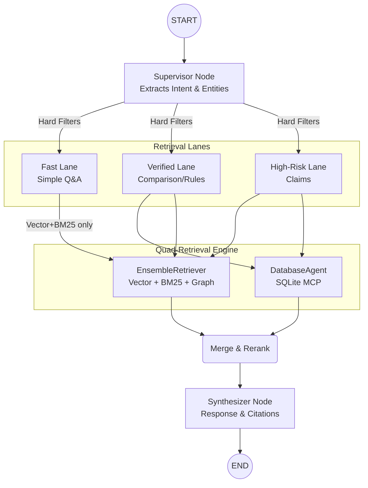

# InsureVN Quad-Retrieval RAG Architecture

## 1. Executive Summary

This document outlines the advanced Retrieval-Augmented Generation (RAG) architecture for InsureVN. Inspired by the logic of frameworks like LightRAG (which uses Graph + Vector dual-level retrieval), this architecture is strictly implemented using **LangChain** and **LangGraph** to maintain enterprise control, structured data supremacy, and high precision required in the insurance domain as defined in [2026-05-03-insurevn-multi-agent-platform-design.md](./2026-05-03-insurevn-multi-agent-platform-design.md).

The retrieval engine relies on **4 Pillars of Retrieval** (Quad-Retrieval) combined via LangChain's `EnsembleRetriever` (or similar reciprocal rank fusion mechanisms) to gather evidence before synthesis.

## 2. The 4 Pillars of Retrieval

To eliminate hallucination and ensure maximum coverage, the LangGraph Retriever Node executes four parallel or sequential retrieval streams:

1. **Semantic Search (Dense Vector - Qdrant)**
   - **Purpose:** Understands "meaning" and context.
   - **Mechanism:** Retrieves document chunks where the meaning matches the query (e.g., matching "điều trị khối u" with "ung thư").
   - **Implementation:** `QdrantVectorStore.as_retriever()`.

2. **Keyword Search (Sparse Vector / BM25)**
   - **Purpose:** Exact term matching. Crucial for insurance policy codes, specific drug names (e.g., "Avastin"), and legal decree numbers.
   - **Mechanism:** Lexical search.
   - **Implementation:** LangChain `BM25Retriever` or Qdrant Sparse Vectors.

3. **Graph Search (Knowledge Graph)**
   - **Purpose:** Multi-hop reasoning and relationship mapping.
   - **Mechanism:** Navigates entities to understand rules (e.g., `Plan: Gold` -> `[EXCLUDES]` -> `Condition: Pre-existing`).
   - **Implementation:** NetworkX in-memory graph (initially) and LangChain `GraphRAGRetriever`.

4. **Structured Facts (SQLite)**
   - **Purpose:** Absolute numerical facts and lineage.
   - **Mechanism:** Exact lookup for limits, premiums, and waiting periods.
   - Implementation: `DatabaseAgent` (wrapped as a LangGraph Node) invoking FastMCP SQLite tools.

## 3. Top-Down "Graph-Guided" Workflow (vs. LightRAG)

While LightRAG uses a "bottom-up" approach (unstructured text -> LLM extracts graph -> vector search finds entry points -> graph expansion), InsureVN requires a **"top-down"** approach due to the strict nature of insurance policies:

1. **Entity Recognition (Supervisor):** The Supervisor Agent extracts core entities from the user query (e.g., Company, Plan, Condition).
2. **Graph/SQL Verification (Hard Filter):** The system queries the SQLite/Graph to find the exact official IDs for these entities.
3. **Scoped Retrieval (Ensemble):** 
   - The IDs are passed as **Hard Filters** to Qdrant (Vector + Keyword).
   - Qdrant *only* searches within the documents of that specific Company/Plan.
4. **Synthesis:** LLM receives the Graph logic path, the exact SQL numbers, and the text chunks (Vector + BM25) to generate a 100% accurate answer with citations.

## 4. Indexing Pipeline (Data Ingestion)

Instead of relying solely on black-box extraction, InsureVN's indexing is controlled:

- **Structured Seeding:** The Graph is pre-seeded with 100% accurate relationships from SQLite (Company -> Plan -> Benefit).
- **LLMGraphTransformer:** For unstructured PDF text (like implicit exclusions), LangChain's `LLMGraphTransformer` is used with strict `allowed_nodes` (Company, Plan, Condition, Exclusion) and `allowed_relationships`. This prevents "graph pollution" (hallucinated or irrelevant nodes).
- **Chunking:** Text chunks are embedded and stored in Qdrant (Dense + Sparse).

## 5. LangGraph Implementation Blueprint

The process is orchestrated as a `StateGraph`:

## 6. Advantages over pure LightRAG

- **Zero Cross-Company Contamination:** Hard filtering guarantees AIA data is never used to answer a Bao Minh question.
- **Auditable Logic:** Graph relationships are seeded from a deterministic database (SQLite), not just guessed by an LLM.
- **Human-in-the-Loop:** LangGraph allows pausing the StateGraph for human review before returning a final claim decision.
