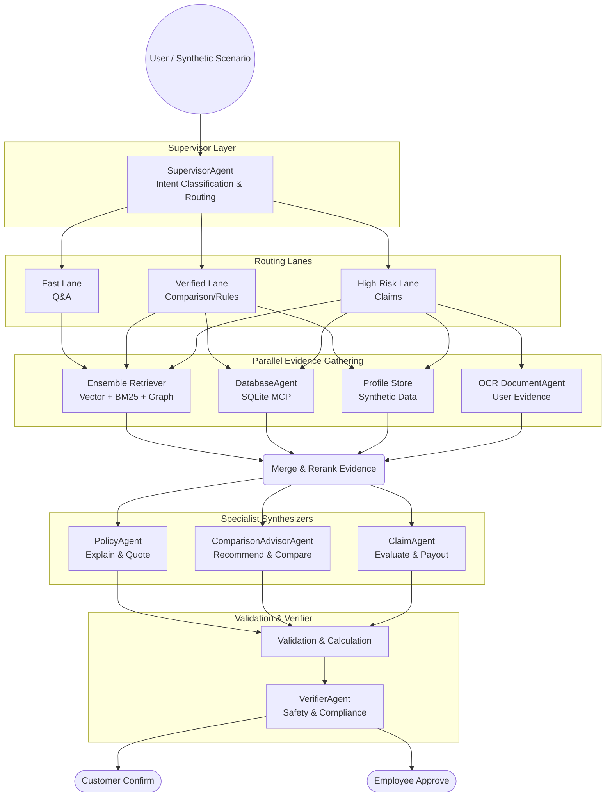

# Design Spec: InsureVN Multi-Agent Platform

## Status

Reviewed. All sections complete. Supersedes `docs/architecture/historical/2026-04-28-multi-agent-system-architecture-strategy.md` for agent architecture decisions. The older document remains as historical reference for the original agent brainstorm, but this spec is the canonical source for implementation. 
**See also:** `docs/architecture/2026-05-04-quad-retrieval-rag-architecture.md` for deep-dive into the LangGraph Ensemble Retrieval methodology.

## Decision Log

| Question | Decision |
|---|---|
| Which RAG product scope should be covered first: Policy Q&A, Claim Advisory, or Product Comparison? | Cover all three and solve all 100 scenarios in `docs/product/customer_intent_scenarios_100_questions.md`. |
| Production posture: local-first, hybrid, or accuracy-first cloud? | Hybrid production. Use local/small models for cheaper tasks and stronger models for hard/final reasoning. |
| First product target: balanced assistant, claim-safe advisor, or comparison engine? | Cover all three target areas. |
| Build order: foundation first, user-flow first, or claim first? | Foundation first. |
| Data source strategy: Markdown-primary, SQLite-primary, or dual-canonical? | Tri-canonical: SQLite for structured facts, Qdrant for document text, Knowledge Graph for entity relationships. |
| SLA strategy: strict fast, balanced lanes, or strict accuracy? | Balanced lanes. Simple questions should be fast; comparison/claim can be slower and more verified. |
| Architecture option: monolithic RAG, routed RAG platform, or full agent swarm? | Full agent swarm. |
| Swarm control style: autonomous agents, orchestrated workflows, or hybrid swarm? | Hybrid swarm. High-risk workflows are controlled; low-risk explanation can be more flexible. |
| Foundation release agent priority: Policy/Evidence, Claim/Rule/Calculator, or Comparison/Advisor? | Include all three verticals in the foundation release, but build them through shared evidence foundation. |
| User data source: chat intake, SQLite profiles, or hybrid? | No real user data. Use AI-generated synthetic data set up before user interaction. |
| Synthetic data scope: basic personas, lifecycle personas, or benchmark dataset? | Include all three: basic personas, lifecycle personas, and benchmark cases. |
| Legal/operational responsibility: advisory, decision support, or operational automation? | Operational automation that creates draft decisions/recommendations. |
| Human review flow: employee first, customer first, or two-step? | Two-step: customer confirms input facts; employee reviews final decision/payout/recommendation. |
| Visual companion usage? | Accepted initially, then user asked to stop updating the browser each question and continue by text. |
| SearchAgent role? | Retained as an optional tool available to ComparisonAdvisorAgent for live web queries (market data, competitor info). Not a core workflow node. |
| Existing agent migration strategy? | Wrap `DatabaseAgent` as a LangGraph node. `SearchAgent` becomes a tool, not a node. New agents built directly on StateGraph. |

## 1. Core Architecture

InsureVN will use a **Hybrid Full Agent Swarm** with a shared evidence foundation. It is not a single monolithic RAG agent.

High-level flow:



The initial implementation should combine orchestrator, intent router, risk router, and evidence planner into one `SupervisorAgent` node to reduce sequential LLM calls. The boundaries still remain explicit in the structured output and tests.

Domain capabilities:

- `SupervisorAgent`: classifies intent/risk, creates retrieval plan, selects workflow.
- `PolicyAgent`: explains policy clauses, exclusions, waiting periods, claim procedures, and glossary terms from evidence.
- `DatabaseAgent`: existing structured data agent over SQLite MCP.
- `ComparisonAdvisorAgent`: compares plans, ranks options, and personalizes recommendations.
- `ClaimAgent`: drafts claim decisions, missing-document guidance, rejection/appeal explanations.
- **ValidationAgent** (The "Judge"): A critical node inspired by *Tree of Thoughts*. It receives the proposed answer and raw evidence to perform a "blind review". It looks for missed exclusions, incorrect limit calculations, or missing citations. It can trigger a "Self-Correction" loop if inconsistencies are found.(langchain_experimental)
- **CalculationAgent** (Deterministic): Non-LLM based node for computing premiums, payouts, and pro-rata refunds. Always uses math/Python logic, never LLM guessing.(langchain_experimental)
- `VerifierAgent`: checks evidence sufficiency, citations, conflicts, and risk gates.
- `OCR DocumentAgent`: Processes dynamic user-uploaded evidence (e.g., medical bills, ID cards). Fixture-backed in the foundation release; later connected to real OCR extraction.

High-risk flows such as claim, payout, rejection, appeal, and fraud suspicion must be orchestrated workflows with strict evidence contracts and human review. Lower-risk explanation and research tasks may use more flexible agent behavior.

### Migration from existing agents

The current codebase uses `langchain.agents.create_agent` (simple ReAct loop) for `DatabaseAgent` and `SearchAgent`. The RAG platform requires a LangGraph `StateGraph` with custom nodes, edges, and reducers. Migration strategy:

- `DatabaseAgent`: wrap as a LangGraph node. The existing `invoke()` method becomes the node function. MCP tool binding remains unchanged.
- `SearchAgent`: demote to a LangChain tool (not a graph node). Available to `ComparisonAdvisorAgent` when live web data is needed (market sentiment, competitor info). Not part of any core workflow lane.
- New agents (`SupervisorAgent`, `PolicyAgent`, `ComparisonAdvisorAgent`, `ClaimAgent`, `VerifierAgent`) are built directly as LangGraph nodes with shared state.

### Deferred agents (post-foundation)

The following agents from `docs/architecture/historical/2026-04-28-multi-agent-system-architecture-strategy.md` are explicitly deferred:

- `Medical Translation & Mapping Agent` (ICD-10 codes): deferred. ClaimAgent handles symptom-to-condition mapping via prompt instructions in v1.
- `Underwriting Assistant Agent`: deferred. Not needed until pre-purchase risk assessment flow is built.
- `Compliance Guardrail Agent`: partially covered by VerifierAgent (evidence sufficiency, citation checks). Full legal disclaimer injection deferred.
- `Escalation & Tone Classifier Agent`: deferred. Emotional detection and human handoff are post-foundation.
- `Data Anonymization (PII/PHI) Agent`: deferred. No real user data in foundation release (synthetic only).
- `QA / Shadow Evaluator Agent`: replaced by Langfuse eval harness in Phase 5.
- `Market Sentiment & Review Agent`: deferred. SearchAgent tool available if needed.
- `Predictive Optimization Agent`: deferred. Requires historical claim data.

## 2. Data & Evidence Layer

The data strategy is **tri-canonical**:

```text
SQLite = structured canonical source (numbers, facts, tables)
Qdrant = document canonical source (legal text, clauses, context)
Knowledge Graph = relationship canonical source (entity connections, reasoning paths)
```

SQLite already exists as a structured evidence provider through the FastMCP server and `DatabaseAgent`. The RAG platform should not redesign SQLite retrieval. It should add adapters that normalize existing MCP results into shared evidence objects.

Existing SQLite MCP tools include:

- `search_benefits`
- `compare_benefits`
- `get_benefit_matrix`
- `get_premium_quotes`
- `search_hospitals`
- `search_waiting_periods`
- `search_claim_payouts`
- `search_glossary_terms`
- `search_exclusions`
- `get_raw_source`
- `list_documents`
- `list_source_tables`

Most MCP results already include source lineage such as `source_table_id`, `document_id`, `source_file_path`, `company_code`, and `document_name`.

Shared evidence schema:

```text
Evidence
- evidence_id
- source_type: sqlite_row | qdrant_chunk | graph_triple | synthetic_profile | document_extract
- source_id
- content
- metadata
- confidence
- retrieved_by
```

SQLite evidence should be produced by a `StructuredEvidenceAdapter`:

```text
MCP tool result
-> StructuredEvidenceAdapter
-> Evidence(source_type="sqlite_row", source_id=source_table_id/tool/row, metadata=...)
-> shared gathered_evidence state
```

Qdrant payload fields:

```text
company_code
document_id
document_type
document_name
product_line
plan_code
section_type
page_number
chunk_index
source_path
source_table_id
effective_date
```

Qdrant retrieval must use hard filters when the user question names or implies a specific company, product, plan, document type, or section. Embedding-only search is not acceptable for company/product-specific insurance questions because policy language is similar across insurers.

`RetrievalPlan` should include:

```text
query_text
hard_filters:
  company_code
  document_id
  document_type
  product_line
  plan_code
  section_type
retrieval_mode: vector | keyword | hybrid | graph | hybrid_graph
expansion_mode: child_only | parent_section | sibling_window | graph_neighborhood
top_k
rerank_required
graph_query:
  start_entity
  relation_types
  max_hops
```

Qdrant should use a parent-child retrieval pattern:

```text
search child chunks -> expand to parent section -> evidence uses expanded parent text
```

Child chunks optimize search precision. Parent sections preserve legal/policy context.

Retrieval lanes (utilizing LangChain `EnsembleRetriever` for Multi-Pillar Retrieval):

- Fast Lane: glossary and simple policy Q&A. Use small `top_k`, hard filters where available. Combine Semantic (Dense Vector) and Keyword (Sparse/BM25) search.
- Verified Lane: comparison, advisor, product recommendation. Run Qdrant (Vector + Keyword), SQLite, and Knowledge Graph retrieval in parallel, merge/deduplicate evidence, and rerank or score evidence. Graph provides relationship context (e.g., which plans share similar exclusions).
- High-risk Lane: claim eligibility, payout, rejection, appeal, fraud suspicion. Require SQLite facts for limits and payout, Knowledge Graph to traverse condition→exclusion→waiting_period chains, and Ensemble Retriever (Vector + BM25) for strict policy text citations.

Evidence merge rules:

- SQLite is preferred for normalized numbers: amount, limit, premium, waiting days, payout rate.
- Qdrant (Dense Vector) is preferred for legal wording, conditions, exceptions, and explanatory context.
- Qdrant (Keyword/BM25) is preferred for exact matches on drug names, disease codes, or policy IDs.
- Knowledge Graph is preferred for relationship reasoning: "gói A có loại trừ bệnh X", "điều kiện Y liên quan đến thời gian chờ Z".
- If any two sources conflict, mark the conflict and route to human review.

Citation requirements:

Every important answer or draft decision must keep enough source lineage for employee review:

```text
company
document_name
document_id
source_file_path or source_path
page_number when available
source_table_id when available
graph_path when available (e.g., Plan→excludes→Condition→requires→WaitingPeriod)
```

### Knowledge Graph Architecture

The Knowledge Graph captures entity relationships that are difficult to express in flat SQL tables or retrieve via vector similarity.

Entity types:

```text
Company
Document
Plan (plan_code, plan_level)
Benefit (benefit_name, category)
Exclusion (condition, scope)
WaitingPeriod (condition, days)
Condition (medical condition, ICD group)
Hospital (name, city, network)
GlossaryTerm (term, definition)
ClaimEvent (event_type, payout_rate)
```

Relationship types:

```text
Company -[OFFERS]-> Plan
Plan -[INCLUDES]-> Benefit
Plan -[EXCLUDES]-> Exclusion
Plan -[HAS_WAITING_PERIOD]-> WaitingPeriod
Exclusion -[APPLIES_TO]-> Condition
WaitingPeriod -[APPLIES_TO]-> Condition
Benefit -[COVERS]-> Condition
Plan -[USES_NETWORK]-> Hospital
Document -[DEFINES]-> Plan
Document -[CONTAINS]-> GlossaryTerm
ClaimEvent -[GOVERNED_BY]-> Benefit
ClaimEvent -[BLOCKED_BY]-> Exclusion
```

Graph storage:

For the foundation release, use **NetworkX** (in-memory Python graph) populated from SQLite data at startup. This avoids adding a new database dependency (Neo4j) while proving the concept.

```text
Startup:
  SQLite tables → extract entities + relationships → NetworkX graph
  Graph persisted as JSON for fast reload

Query:
  SupervisorAgent identifies start_entity from user query
  GraphRetriever traverses N hops from start_entity
  Returns subgraph as Evidence(source_type="graph_triple")
```

Scale-up path: migrate to Neo4j or Qdrant's built-in graph features when the in-memory graph exceeds practical size or when multi-hop queries need indexing.

Graph construction pipeline:

```text
1. Extract entities from SQLite domain tables:
   - companies → Company nodes
   - plan_types → Plan nodes
   - benefit_items + benefit_values → Benefit nodes
   - glossary_terms → GlossaryTerm nodes
   - waiting_periods → WaitingPeriod + Condition nodes
   - claim_payouts → ClaimEvent nodes
   - hospitals → Hospital nodes
   - exclusions from benefit_items.note + glossary_terms → Exclusion nodes

2. Extract relationships from foreign keys + parsed text:
   - plan_types.company_id → Company-OFFERS->Plan
   - benefit_values.plan_type_id → Plan-INCLUDES->Benefit
   - waiting_periods joined with condition text → Plan-HAS_WAITING_PERIOD->WaitingPeriod
   - exclusion keywords in benefit_items.note → Plan-EXCLUDES->Exclusion
   - hospitals.document_id → Plan-USES_NETWORK->Hospital

3. LLM-assisted extraction for complex relationships:
   - Parse Qdrant document chunks for implicit exclusion→condition links
   - Validate extracted triples against SQLite facts
```

Example graph queries:

```text
Q: "Gói Gold của AIA có loại trừ bệnh ung thư không?"
→ START: Plan(company=AIA, code=Gold)
→ TRAVERSE: Plan-[EXCLUDES]->Exclusion-[APPLIES_TO]->Condition(name~"ung thư")
→ RESULT: list of exclusion paths or empty (not excluded)

Q: "So sánh thời gian chờ giữa AIA và Bảo Minh cho bệnh có sẵn"
→ START: Condition(name="bệnh có sẵn")
→ TRAVERSE: Condition<-[APPLIES_TO]-WaitingPeriod<-[HAS_WAITING_PERIOD]-Plan-[OFFERED_BY]->Company
→ RESULT: comparison table of waiting periods grouped by company

Q: "Bệnh viện nào trong mạng lưới của cả AIA và Liberty tại HCM?"
→ START: Company(code=AIA), Company(code=Liberty)
→ TRAVERSE: Company-[OFFERS]->Plan-[USES_NETWORK]->Hospital(city=HCM)
→ RESULT: intersection of hospital sets
```

## 3. Agent Workflows & Routing

The platform uses a **Hybrid Swarm**: specialist capabilities exist, but high-risk flows are controlled by LangGraph state, routing, and verification gates.

Core graph state:

```text
messages
user_profile
synthetic_scenario
intent
risk_level
retrieval_plan
gathered_evidence
draft_decisions
review_packet
final_output
```

Append-only fields should use reducers so parallel nodes do not overwrite one another:

```text
gathered_evidence
draft_decisions
messages
```

2. **Reasoning & Verification Loop (Tree of Thoughts Pattern):(langchain_experimental)**
   - After an agent (e.g., ClaimAgent) proposes a solution, the **ValidationAgent** performs a critique.
   - If the ValidationAgent detects a risk (e.g., a potential exclusion in the Graph that wasn't addressed), it sends the state back to the Retriever/ClaimAgent with a "Reasoning Gap" instruction.
   - This ensures the final output has passed at least two levels of internal "thinking".

### 3.1 Conversation Memory

All workflows must use a LangGraph checkpointer with `thread_id` for multi-turn conversation continuity. Many of the 100 customer intents are conversational (e.g., Q32 → follow-up "Còn gói nào rẻ hơn không?"). Without checkpointing, every message is a cold start.

```text
Dev/local: SqliteSaver (from langgraph-checkpoint-sqlite)
Production: PostgresSaver (from langgraph-checkpoint-postgres)
Never: MemorySaver (data lost on restart)
```

Every `graph.ainvoke()` call must pass `config={"configurable": {"thread_id": session_id}}`. The `session_id` from the API request maps directly to `thread_id`.

The `SupervisorAgent` should use structured output, ideally with a Pydantic schema and `llm.with_structured_output(...)`. Local/Ollama models may need JSON repair fallback, while stronger hybrid/cloud models should be preferred for reliable routing.

Supervisor output:

```text
intent_group: policy_qa | comparison | advisory | claim | payout | onboarding | renewal | hospital_network | registration
risk_level: low | medium | high
workflow: fast_policy | verified_compare | high_risk_claim | lifecycle_advisory
required_evidence: qdrant | sqlite | profile | document
hard_filters
needs_clarification
clarification_question
```

Intent group mapping to 100 customer intents:

```text
policy_qa        → Q1-15 (Nhận thức & tìm hiểu)
comparison       → Q16-30 (So sánh & lựa chọn)
advisory         → Q31-45 (Tư vấn cá nhân hóa)
registration     → Q46-55 (Đăng ký & mua)
onboarding       → Q56-65 (Onboarding & quản lý hợp đồng)
hospital_network → Q66-75 (Sử dụng & khám chữa bệnh)
claim            → Q76-90 (Claim)
payout           → Q91-95 (Payout & giải thích)
renewal          → Q96-100 (Renewal & tối ưu)
```

Hard filter extraction:

The SupervisorAgent must extract entity filters from the user query to produce `hard_filters`. Two-stage approach:

1. LLM structured output extracts candidate `company_code`, `product_line`, `plan_code`, `document_type` from the user query as part of `SupervisorDecision`.
2. Candidate values are validated against known values from SQLite (`list_companies`, `list_plans` cached at startup) before being passed to Qdrant. Unknown values are dropped with a log warning.

This prevents hallucinated filter values from producing zero-result Qdrant queries.

Fast Policy Lane:

```text
Supervisor
-> Fast Lane
-> Ensemble Retriever (Vector + BM25)
-> EvidenceMerger
-> PolicyAgent drafts answer
-> Validation & VerifierAgent (Citation check)
-> Answer
```

Verified Compare/Advisor Lane:

```text
Supervisor
-> Verified Lane
-> Parallel:
   - DatabaseAgent (SQLite MCP)
   - Ensemble Retriever (Vector + BM25 + Graph)
   - Profile Store
-> EvidenceMerger
-> ComparisonAdvisorAgent
-> Validation & VerifierAgent
-> Recommendation packet
```

High-risk Claim/Payout Lane:

```text
Supervisor
-> High-Risk Lane
-> OCR DocumentAgent (User Evidence)
-> Parallel:
   - DatabaseAgent (SQLite MCP) for Facts
   - Ensemble Retriever (Vector + BM25 + Graph) for Citations & Logic
   - Profile Store
-> EvidenceMerger
-> RuleChecker & Calculator tools
-> ClaimAgent drafts decision
-> ValidationAgent & VerifierAgent
-> Customer confirms input
-> Employee reviews final decision
```

`EvidenceMerger` should be pure Python in the foundation release:

```text
normalize source keys
deduplicate by source_type + source_id + content hash
group by company/document/plan
detect simple conflicts
build compact evidence context
preserve citations
```

Parallel retrieval:

- Fixed providers can be routed through conditional edges to multiple nodes.
- Dynamic fan-out, such as multiple Qdrant tasks per company/product/query, should use LangGraph `Send`.

Specialist boundaries:

- `PolicyAgent` explains only from evidence and does not calculate payout.
- `ComparisonAdvisorAgent` ranks and recommends, but structured facts come from SQLite/evidence.
- `ClaimAgent` drafts claim decisions, but deterministic checks and calculations use tools/nodes.
- `VerifierAgent` checks evidence quality and risk; it does not invent a new answer.
- `DatabaseAgent` remains the existing structured data specialist over MCP.

Human-in-the-loop:

```text
Draft decision
-> customer confirms facts/input
-> employee approves/edits/rejects
-> final response
```

LangGraph interrupts and checkpointing should be used for the customer confirmation and employee approval pauses.

## 4. Synthetic Data, Evaluation & Review

The foundation release will use AI-generated synthetic user data because the project does not yet have real customer profiles, contracts, or claim histories. Synthetic data must be stored like product data so agents can query it through normal workflows.

Synthetic data layers:

```text
1. Basic Personas
- age
- gender
- income
- job
- city
- family/dependents
- lifestyle
- health background
- risk tolerance

2. Lifecycle Personas
- active policies
- plan/company/product_line
- effective date
- payment status
- renewal date
- dependents
- preferred hospitals
- previous claims
- claim statuses

3. Scenario Benchmark Cases
- maps to the 100 customer intents
- user profile
- input question
- expected evidence types
- expected behavior
- risk level
- acceptance criteria
```

Synthetic data should be stored in SQLite with clearly prefixed tables:

```text
synthetic_users
synthetic_policies
synthetic_dependents
synthetic_claims
synthetic_documents
synthetic_benchmark_cases
```

Synthetic data generation should use LLM structured output plus deterministic validation:

```text
LLM + Pydantic schema
-> small seed generation
-> deterministic validation
-> SQLite insert
-> benchmark/eval run
-> scale up only after validation passes
```

Start with 30-50 personas and 100 benchmark cases mapped to the 100 intent scenarios. Scale to 500-1,000 personas only after the schema, validation, and eval loop are stable.

Synthetic data must reference real insurance data where possible:

```text
company_code
document_id
plan_type_id
product_line
plan_code
```

The generator must not invent companies, product lines, or plan identifiers that do not exist in the real SQLite insurance tables.

Evaluation layers:

```text
Retrieval eval:
- correct company/product/document
- hard filters used when required
- source_table_id/document_id/page retained

Evidence eval:
- sufficient evidence for answer
- SQLite vs Qdrant conflicts detected
- citations trace back to source

Answer eval:
- correct intent
- no hallucinated numbers/benefits
- admits missing evidence when evidence is incomplete

Workflow eval:
- claim/payout uses RuleChecker and Calculator
- high-risk flows create review packets
- HITL pauses at customer confirmation and employee review
```

Langfuse Scores should be used for repeatable evaluation. Current Langfuse docs support attaching scores to traces, observations, sessions, and dataset runs through the SDK/API.

Recommended scores:

```text
retrieval_score
evidence_sufficiency_score
citation_score
hallucination_score
workflow_score
human_review_outcome
```

Use deterministic scores where possible:

```text
citation_score = 1 if every important claim has citation, else 0
workflow_score = 1 if high-risk claim went through RuleChecker + Calculator + HITL, else 0
```

Use LLM-as-a-Judge only for qualitative dimensions:

```text
answer_correctness
groundedness
tone_clarity
missing_evidence_reasoning
```

LLM-as-a-Judge must not be the only evaluator for high-risk claim/payout decisions.

Human review packets:

Customer confirmation packet:

```text
user profile facts used
policy assumed
claim/event details assumed
documents received/missing
questions needing confirmation
```

Employee review packet:

```text
draft decision
payout estimate if any
rule checks
calculator output
evidence list with citations
conflicts or missing evidence
recommended final action
editable final response
```

Review outcomes:

```text
customer_confirmed
customer_corrected
employee_approved
employee_edited
employee_rejected
needs_more_evidence
```

## 5. Implementation Phasing & Testing

Because the scope is large, implementation should be split into verticals that can be tested independently.

### Phase 1: Evidence Foundation + Benchmark Fixtures

Goal: normalize evidence from existing SQLite MCP, minimal synthetic profiles, Qdrant stubs/fixtures, and benchmark test cases for routing validation.

Build:

```text
Evidence schema
StructuredEvidenceAdapter for existing SQLite MCP results
synthetic_users and synthetic_policies minimal tables
basic synthetic seed data, deterministic or small hand-authored fixture
profile lookup adapter
EvidenceMerger pure Python
Citation formatter
RetrievalPlan schema
synthetic_benchmark_cases table (100 rows mapped to customer intents)
benchmark fixtures: expected intent_group, risk_level, workflow per case
```

The 100 benchmark cases are pulled into Phase 1 because Phase 3 (Supervisor routing) tests require them. These are test fixtures, not full synthetic profiles — they need only: `input_question`, `expected_intent_group`, `expected_risk_level`, `expected_workflow`, `expected_evidence_types`.

Tests:

```text
MCP row -> Evidence object
profile row -> Evidence object
deduplicate evidence by source_id/content hash
citation contains document_id/source_table_id/source_file_path
conflict detection between SQLite and Qdrant fixture
benchmark_cases table has 100 rows with valid intent_groups
```

### Phase 2a: Qdrant Document Retrieval

Goal: add the document canonical source.

Build:

```text
Markdown/PDF chunking pipeline
parent-child chunk metadata
Qdrant collection setup
hard-filtered retrieval
hybrid vector + keyword retrieval if feasible
parent section expansion
```

Embedding and chunking strategy:

```text
Embedding model: multilingual-e5-large or bge-m3 (must handle Vietnamese diacritics)
Child chunk size: 512 tokens with 64-token overlap
Parent section: full markdown section (## heading boundary)
Chunk metadata: all Qdrant payload fields from Section 2
Hybrid search: Qdrant built-in sparse vectors (BM25-like) + dense vectors
Fallback: dense-only if sparse indexing adds unacceptable latency
```

Vietnamese language considerations:

- Embedding model must be evaluated on Vietnamese insurance text, not just general benchmarks.
- Diacritics normalization: queries should match both `bảo hiểm` and `bao hiem` (NFC normalization).
- Keyword search tokenization: use underthesea or pyvi for Vietnamese word segmentation if BM25 is used.

Tests:

```text
company-specific query cannot retrieve another company when hard filter exists
child search returns parent context
payload has required citation fields
retrieval benchmark for policy/exclusion/waiting-period cases
Vietnamese diacritics query returns same results as ASCII equivalent
```

### Phase 2b: Knowledge Graph Construction

Goal: build the relationship canonical source from existing SQLite data.

Build:

```text
Entity extraction from SQLite domain tables
Relationship extraction from foreign keys + parsed text
NetworkX graph construction
Graph serialization to JSON for fast reload
GraphRetriever with N-hop traversal
GraphEvidenceAdapter to produce Evidence(source_type="graph_triple")
LLM-assisted extraction for implicit exclusion/condition links from Qdrant chunks
```

Graph quality validation:

```text
Every Plan node must link to at least 1 Benefit
Every Company node must link to at least 1 Plan
No orphan nodes (entities without any relationship)
Relationship counts must be consistent with SQLite row counts
```

Tests:

```text
Company(AIA)->OFFERS->Plan returns all AIA plans from SQLite
Plan->EXCLUDES->Exclusion->APPLIES_TO->Condition traversal returns valid chains
Graph entity count matches SQLite entity count (±5% tolerance for LLM-extracted entities)
Graph reload from JSON produces identical traversal results
Multi-hop query (Plan→Exclusion→Condition) returns within 100ms
```

### Phase 3: Supervisor + Routing

Goal: route requests to the correct lane/workflow.

Build:

```text
SupervisorDecision Pydantic schema
llm.with_structured_output for Supervisor
JSON repair fallback for local model
LangGraph state schema
fixed parallel retrieval branches
Send-based dynamic fan-out later
```

Tests:

```text
100 intent examples route to expected intent_group
high-risk questions become high-risk
company/product questions produce hard_filters
ambiguous product questions ask clarification or switch comparison workflow
```

### Phase 4: Specialist Workflows

Goal: run the three main verticals end-to-end.

Build:

```text
Fast Policy Lane
Verified Compare/Advisor Lane
High-risk Claim/Payout Lane
RuleChecker deterministic node
Calculator deterministic tools
VerifierAgent
```

Tests:

```text
Policy Q&A answer cites sources
Comparison uses SQLite benefits/premiums and Qdrant context
Claim workflow calls RuleChecker + Calculator
Verifier blocks unsupported payout/claim decisions
```

### Phase 5: Synthetic Dataset + Eval Harness

Goal: make quality measurable after every prompt/code change.

Build:

```text
LLM + Pydantic synthetic data generator
full SQLite synthetic tables:
  synthetic_dependents
  synthetic_claims
  synthetic_documents
  synthetic_benchmark_cases
100 benchmark cases
eval runner
Langfuse score attachment
```

Tests:

```text
generated synthetic data validates foreign keys
each benchmark case has expected evidence/workflow
eval scores are written deterministically
benchmark can run offline with fixtures where possible
```

### Phase 6: HITL Review Workflow

Goal: operational automation with customer confirmation and employee approval.

Build:

```text
ReviewPacket schema
customer confirmation interrupt
employee review interrupt
approval/edit/reject outcomes
persistent LangGraph checkpointing
stable thread_id/session_id for every HITL workflow
```

Use a persistent checkpointer. In local/dev, SQLite checkpointer is acceptable. For production-like concurrency, Postgres checkpointer is preferable. Memory checkpointers are not acceptable for review flows that can resume after server restart or across different days.

Tests:

```text
high-risk claim pauses for customer confirmation
edited customer facts trigger recomputation
employee rejection prevents final decision
approved packet creates final response
workflow can resume after process restart when using persistent checkpoint
```

### Testing Pyramid

```text
Unit:
- schemas
- adapters
- rule checks
- calculators
- citation formatter
- evidence merger

Integration:
- SQLite MCP tools
- DatabaseAgent
- Qdrant retriever
- Knowledge Graph traversal
- Supervisor routing
- LangGraph lane execution

E2E:
- 100 benchmark scenarios
- claim/payout high-risk scenarios
- comparison/advisory scenarios
- HITL resume flows
```

### Success Criteria

Foundation release is acceptable only if:

```text
90%+ routing accuracy on 100 benchmark intents
95%+ high-risk cases routed to high-risk lane
0 unsupported payout final decisions without review
every important answer has citation
SQLite/Qdrant/Graph conflict becomes review-required
benchmark results are logged to Langfuse Scores
graph traversal queries return within 200ms P95
Fast Lane P95 latency < 5s
Verified Lane P95 latency < 15s
High-risk Lane P95 latency < 30s
evidence recall >= 80% (expected sources actually retrieved)
false-positive high-risk rate < 10% (simple questions over-routed)
```
