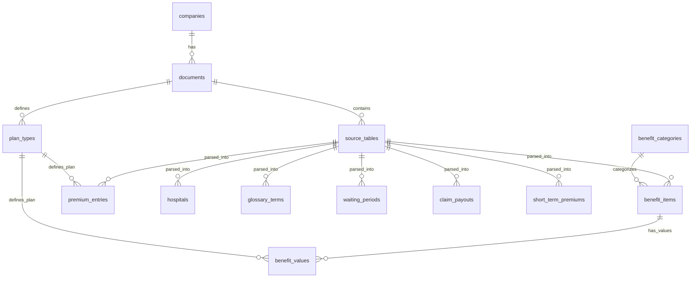

# InsureVN — Database Schema

> SQLite schema for Vietnamese health insurance document data.
> Generated: 2026-05-02 | Database: `database/insurevn.db`

---

## Overview



## Architecture: 3-Layer Design

| Layer | Purpose | Tables |
|---|---|---|
| **1. Source Lineage** | Truy ngược về JSON gốc | `companies`, `documents`, `source_tables` |
| **2. Plan Normalization** | Chuẩn hóa tên gói BH cross-company | `plan_types`, `benefit_categories` |
| **3. Domain Tables** | Dữ liệu BH chuẩn hóa (long format) | `benefit_items`, `benefit_values`, `premium_entries`, `hospitals`, `glossary_terms`, `waiting_periods`, `claim_payouts`, `short_term_premiums` |

## Current Data Volume

| Table | Rows | Description |
|---|---:|---|
| `companies` | 6 | Công ty BH |
| `documents` | 83 | File PDF gốc |
| `source_tables` | 644 | File JSON trích xuất |
| `plan_types` | 424 | Các gói BH |
| `benefit_categories` | 10 | Phân nhóm quyền lợi |
| `benefit_items` | 1,236 | Hạng mục quyền lợi |
| `benefit_values` | 3,766 | Giá trị theo plan (long format) |
| `premium_entries` | 1,771 | Phí BH theo tuổi/plan |
| `hospitals` | 7,004 | Bệnh viện/phòng khám |
| `glossary_terms` | 290 | Thuật ngữ BH |
| `waiting_periods` | 91 | Thời gian chờ |
| `claim_payouts` | 551 | Tỷ lệ chi trả |
| `short_term_premiums` | 51 | Phí ngắn hạn |

---

## Layer 1: Source Lineage

### `companies`
Công ty bảo hiểm. Seed data, idempotent.

| Column | Type | Description |
|---|---|---|
| `id` | INTEGER PK | |
| `code` | TEXT UNIQUE | `'aia'`, `'pacific_cross'`, `'bic'`, `'liberty'`, `'baominh'`, `'pti'` |
| `name` | TEXT | Tên đầy đủ |
| `website` | TEXT | Website |
| `created_at` | DATETIME | |

**Current data:** AIA (32 docs), Pacific Cross (19), BaoMinh (14), BIC (13), Liberty (3), PTI (2)

### `documents`
Mỗi file PDF gốc = 1 document.

| Column | Type | Description |
|---|---|---|
| `id` | INTEGER PK | |
| `company_id` | INTEGER FK → companies | |
| `source_path` | TEXT UNIQUE | `'aia/2711-BHSK-Bung-Gia-Luc-...'` |
| `document_name` | TEXT | Tên folder chứa PDF |
| `document_type` | TEXT | `'policy'`, `'brochure'`, `'pricing'`, `'hospital_list'` |
| `language` | TEXT | Default `'vi'` |
| `description` | TEXT | Mô tả tài liệu |
| `effective_date` | DATE | Ngày hiệu lực |
| `version` | TEXT | Phiên bản |
| `created_at` | DATETIME | |

**Indexes:** `company_id`, `document_type`

### `source_tables`
Mỗi file JSON trích xuất = 1 source_table. **Bảng trung tâm** — mọi data đều truy ngược về đây.

| Column | Type | Description |
|---|---|---|
| `id` | INTEGER PK | |
| `document_id` | INTEGER FK → documents | |
| `file_path` | TEXT UNIQUE | Path JSON (relative) |
| `table_type` | TEXT | Category: `'benefit_items'`, `'hospitals'`, etc. |
| `classification_reason` | TEXT | LLM description |
| `classification_confidence` | TEXT | `'rule'`, `'llm'`, `'manual'` |
| `page_number` | INTEGER | Trang PDF gốc |
| `table_index` | INTEGER | Thứ tự bảng trong trang |
| `raw_json` | JSON | Toàn bộ JSON gốc |
| `keys` | TEXT | Comma-separated keys: `'Cơ bản,Nâng cao,...'` |
| `content_type` | TEXT | `'table'`, `'text'`, `'mixed'` |
| `processed` | BOOLEAN | Default FALSE |
| `error_reason` | TEXT | Nếu parse lỗi |
| `created_at` | DATETIME | |

**Indexes:** `document_id`, `table_type`, `processed`

---

## Layer 2: Plan Normalization

### `plan_types`
Mapping từ raw plan name → normalized code. Rosetta stone cross-company.

| Column | Type | Description |
|---|---|---|
| `id` | INTEGER PK | |
| `company_id` | INTEGER FK → companies | |
| `document_id` | INTEGER FK → documents | |
| `raw_name` | TEXT | Tên gốc: `'Cơ bản'`, `'CƠ BẢN'`, `'Plan H1'` |
| `normalized_code` | TEXT | `'basic'`, `'standard'`, `'advanced'`, `'premium'` |
| `plan_level` | INTEGER | 1, 2, 3, 4 (sort/compare) |
| `product_line` | TEXT | `'BHSK-Bung-Gia-Luc'`, `'Health-First'` |
| `created_at` | DATETIME | |

**UNIQUE:** `(document_id, raw_name)`

**Standard plan mapping (AIA):**

| Raw Name | Normalized Code | Level |
|---|---|---|
| Cơ bản / CƠ BẢN | `basic` | 1 |
| Nâng cao / NÂNG CAO | `standard` | 2 |
| Toàn diện / TOÀN DIỆN | `advanced` | 3 |
| Hoàn hảo / HOÀN HẢO | `premium` | 4 |

### `benefit_categories`
Phân nhóm quyền lợi (tree structure). Seed data.

| Column | Type | Description |
|---|---|---|
| `id` | INTEGER PK | |
| `code` | TEXT UNIQUE | |
| `name_vi` | TEXT | |
| `name_en` | TEXT | |
| `parent_id` | INTEGER FK → self | Tree structure |

**Seed values:** `inpatient`, `outpatient`, `emergency`, `maternity`, `dental`, `cancer`, `mental_health`, `accident`, `life`, `day_treatment`

---

## Layer 3: Domain Tables

> [!IMPORTANT]
> All domain tables use **long/narrow format** — one row per value, not wide columns per plan.
> Every domain row has `source_table_id` + `raw_row JSON` for full traceability.

### `benefit_items`
Mỗi hàng quyền lợi BH = 1 benefit_item. Giá trị theo plan nằm ở `benefit_values`.

| Column | Type | Description |
|---|---|---|
| `id` | INTEGER PK | |
| `source_table_id` | INTEGER FK → source_tables | |
| `document_id` | INTEGER FK → documents | |
| `category_id` | INTEGER FK → benefit_categories | Nullable |
| `row_index` | INTEGER | Vị trí trong structured_data[] |
| `raw_row` | JSON | Row JSON gốc |
| `raw_name` | TEXT | `'Phòng và Giường bệnh'` |
| `normalized_name` | TEXT | Chuẩn hóa (future) |
| `display_order` | INTEGER | Thứ tự hiển thị |
| `applicable_to` | TEXT | `'Áp dụng cho'`, `'Mỗi ngày'` |
| `note` | TEXT | Ghi chú thêm |
| `created_at` | DATETIME | |

### `benefit_values`
Giá trị quyền lợi **THEO TỪNG PLAN** — long table.

| Column | Type | Description |
|---|---|---|
| `id` | INTEGER PK | |
| `benefit_item_id` | INTEGER FK → benefit_items | |
| `plan_type_id` | INTEGER FK → plan_types | |
| `value` | TEXT | Raw: `'500,000,000'`, `'Không giới hạn'`, `'✓'` |
| `value_numeric` | REAL | Parsed nếu là số |
| `value_context` | TEXT | `'mỗi ngày'`, `'mỗi lần điều trị'` |
| `limit_type` | TEXT | `'per_day'`, `'per_visit'`, `'per_year'` |
| `unit` | TEXT | `'VND'`, `'%'`, `'ngày'` |
| `is_covered` | BOOLEAN | |
| `note` | TEXT | |

### `premium_entries`
Phí BH theo tuổi/plan — long format.

| Column | Type | Description |
|---|---|---|
| `id` | INTEGER PK | |
| `source_table_id` | INTEGER FK → source_tables | |
| `document_id` | INTEGER FK → documents | |
| `plan_type_id` | INTEGER FK → plan_types | |
| `row_index` | INTEGER | |
| `raw_row` | JSON | |
| `age_min` | INTEGER | |
| `age_max` | INTEGER | |
| `age_label` | TEXT | Raw: `'0-3'`, `'19-25'`, `'Dưới 14 ngày'` |
| `premium_amount` | REAL | Số tiền phí |
| `currency` | TEXT | Default `'VND'` |
| `period` | TEXT | Default `'annual'` |
| `year_label` | TEXT | `'PHÍ NĂM 1'`, `'PHÍ NĂM 2'` |
| `created_at` | DATETIME | |

### `hospitals`
Danh sách bệnh viện/phòng khám.

| Column | Type | Description |
|---|---|---|
| `id` | INTEGER PK | |
| `source_table_id` | INTEGER FK → source_tables | |
| `document_id` | INTEGER FK → documents | |
| `row_index` | INTEGER | |
| `raw_row` | JSON | |
| `name_vi` | TEXT | Tên tiếng Việt |
| `name_en` | TEXT | Tên tiếng Anh |
| `address` | TEXT | |
| `city` | TEXT | |
| `country` | TEXT | Default `'VN'` |
| `phone` | TEXT | |
| `hospital_type` | TEXT | |
| `gop_supported` | BOOLEAN | Bảo lãnh viện phí |
| `gop_time` | TEXT | |
| `working_hours` | TEXT | |
| `external_id` | TEXT | STT / No. / ID từ nguồn |
| `note` | TEXT | |
| `created_at` | DATETIME | |

### `glossary_terms`
Thuật ngữ bảo hiểm.

| Column | Type | Description |
|---|---|---|
| `id` | INTEGER PK | |
| `source_table_id` | INTEGER FK → source_tables | |
| `document_id` | INTEGER FK → documents | |
| `row_index` | INTEGER | |
| `raw_row` | JSON | |
| `term` | TEXT | Thuật ngữ |
| `definition` | TEXT | Định nghĩa |
| `language` | TEXT | Default `'vi'` |
| `created_at` | DATETIME | |

### `waiting_periods`
Thời gian chờ.

| Column | Type | Description |
|---|---|---|
| `id` | INTEGER PK | |
| `source_table_id` | INTEGER FK → source_tables | |
| `document_id` | INTEGER FK → documents | |
| `row_index` | INTEGER | |
| `raw_row` | JSON | |
| `condition_group` | TEXT | Nhóm bệnh |
| `condition_detail` | TEXT | |
| `waiting_days` | INTEGER | |
| `waiting_text` | TEXT | Raw: `'180 ngày'`, `'12 tháng'` |
| `created_at` | DATETIME | |

### `claim_payouts`
Tỷ lệ chi trả (sự kiện BH → % chi trả).

| Column | Type | Description |
|---|---|---|
| `id` | INTEGER PK | |
| `source_table_id` | INTEGER FK → source_tables | |
| `document_id` | INTEGER FK → documents | |
| `row_index` | INTEGER | |
| `raw_row` | JSON | |
| `event` | TEXT | Sự kiện BH |
| `payout_rate` | REAL | % chi trả |
| `payout_text` | TEXT | Raw text |
| `created_at` | DATETIME | |

### `short_term_premiums`
Phí ngắn hạn.

| Column | Type | Description |
|---|---|---|
| `id` | INTEGER PK | |
| `source_table_id` | INTEGER FK → source_tables | |
| `document_id` | INTEGER FK → documents | |
| `row_index` | INTEGER | |
| `raw_row` | JSON | |
| `duration_text` | TEXT | |
| `duration_days` | INTEGER | |
| `premium_rate` | REAL | |
| `created_at` | DATETIME | |

---

## Data Integrity

All foreign key constraints verified ✅:

| Relationship | Status |
|---|---|
| `documents` → `companies` | ✅ |
| `source_tables` → `documents` | ✅ |
| `benefit_items` → `source_tables` | ✅ |
| `benefit_values` → `benefit_items` | ✅ |
| `benefit_values` → `plan_types` | ✅ |
| `premium_entries` → `plan_types` | ✅ |
| All domain tables → `source_tables` | ✅ |

---

## Data Pipeline


| Step | Script | Output |
|---|---|---|
| 1. Extraction | `scripts/04_extraction/` | JSON files |
| 2. Schema Mapping | `11_llm_schema_mapping.py` | `schema_mapping.json` + `review.csv` |
| 3. DB Ingestion | `02_ingest_with_mapping_sqlite.py` | SQLite tables |
| 4. Review | (auto after ingestion) | `db_review/*.csv` |

---

## Useful Queries

### So sánh quyền lợi giữa các plan
```sql
SELECT bi.raw_name, pt.normalized_code, bv.value, bv.value_numeric
FROM benefit_values bv
JOIN benefit_items bi ON bv.benefit_item_id = bi.id
JOIN plan_types pt ON bv.plan_type_id = pt.id
WHERE bi.document_id = 1
ORDER BY bi.row_index, pt.plan_level;
```

### Tìm phí BH theo tuổi
```sql
SELECT c.name, pt.raw_name, pe.age_label, pe.premium_amount
FROM premium_entries pe
JOIN plan_types pt ON pe.plan_type_id = pt.id
JOIN documents d ON pe.document_id = d.id
JOIN companies c ON d.company_id = c.id
WHERE pe.age_min <= 30 AND pe.age_max >= 30
ORDER BY pe.premium_amount;
```
### Tìm bệnh viện theo thành phố
```sql
SELECT h.name_vi, h.address, h.phone, c.name AS company
FROM hospitals h
JOIN documents d ON h.document_id = d.id
JOIN companies c ON d.company_id = c.id
WHERE h.city LIKE '%Hồ Chí Minh%'
ORDER BY h.name_vi;
```

### Truy ngược dữ liệu về file JSON gốc
```sql
SELECT st.file_path, st.raw_json, st.table_type
FROM source_tables st
WHERE st.id = <source_table_id>;
```
