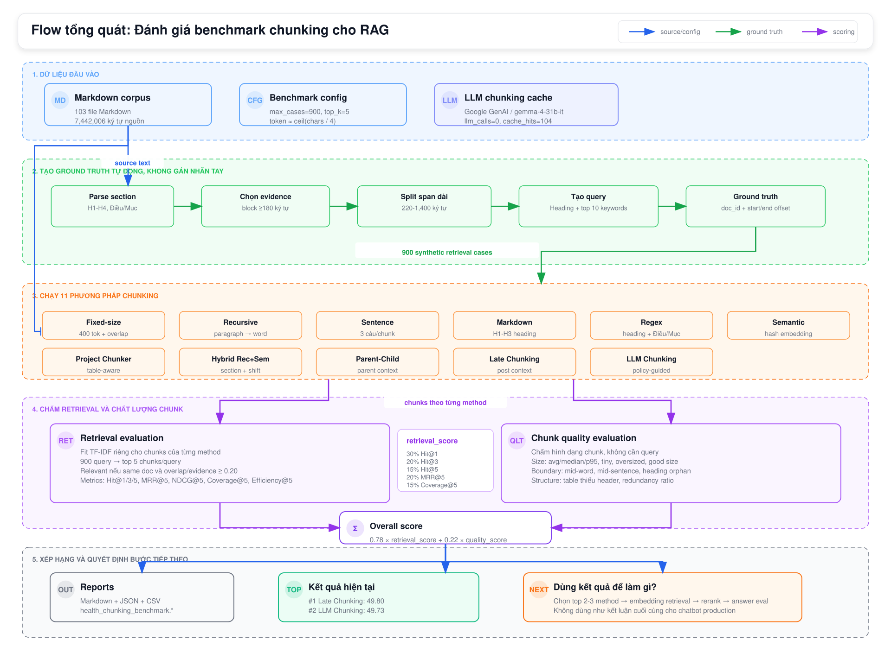

# Hướng Dẫn Đánh Giá Benchmark Chunking

> Cấu trúc báo cáo kỹ thuật được áp dụng ngày 2026-05-09. Nội dung gốc lịch sử được giữ ở Mục 10 để truy vết.

## 1. Tóm tắt điều hành

Báo cáo kỹ thuật này ghi lại tài liệu nhật ký công việc `2026-05-07-health-chunking-benchmark-evaluation-guide-technical-report.md` của InsureVN. Tài liệu được chuẩn hóa theo định dạng báo cáo kỹ thuật của dự án, đồng thời giữ nguyên nội dung và bằng chứng gốc bên dưới.

## 2. Mục tiêu và phạm vi

Mục tiêu là ghi lại công việc, quy trình, quyết định, benchmark hoặc inventory được mô tả trong file gốc. Phạm vi chuẩn hóa chỉ giới hạn ở tài liệu: không chạy lại benchmark, không thay đổi code triển khai và không thay đổi ý nghĩa của report gốc.

## 3. Bối cảnh

Phân loại: Giai đoạn Training & Eval; phương pháp benchmark và hướng dẫn đánh giá chunking cho bảo hiểm sức khỏe.

Báo cáo này thuộc `docs/work_log/`, khu vực dùng cho báo cáo kỹ thuật, báo cáo benchmark, nhật ký quy trình và lịch sử triển khai của InsureVN.

## 4. Triển khai

Chi tiết triển khai, quy trình hoặc phân tích gốc được giữ trong Mục 10. Trong lần chuẩn hóa này, tài liệu được bọc bằng cấu trúc báo cáo kỹ thuật chung để các nhật ký công việc sau này có cùng bố cục về bối cảnh, bằng chứng, xác minh, kết quả, rủi ro và việc tiếp theo.

## 5. Bằng chứng và lệnh đã chạy

Bằng chứng dùng cho lần chuẩn hóa này:

- Tài liệu nguồn hiện có: `docs/work_log/2026-05-07-health-chunking-benchmark-evaluation-guide-technical-report.md`
- Lệnh quét danh sách file: `find docs/work_log -maxdepth 2 -type f -print | sort`
- Lệnh kiểm tra heading: `rg -n '^#{1,3} ' docs/work_log/*.md`
- Kiểm tra template: đã kiểm tra sự tồn tại của `## 1. Tóm tắt điều hành` trong toàn bộ file work log

Bằng chứng, lệnh, đường dẫn, số liệu và hiện vật đầu ra riêng của task gốc vẫn được giữ trong Mục 10.

## 6. Xác minh

Các bước xác minh đã thực hiện cho lần chuẩn hóa tài liệu này:

- Đã xác nhận file nằm trong `docs/work_log/`.
- Đã thêm đầy đủ các mục bắt buộc của báo cáo kỹ thuật.
- Đã giữ nguyên phần nội dung cũ thay vì viết lại metrics hoặc kết luận lịch sử.

Xác minh riêng của task gốc, nếu có, vẫn nằm trong Mục 10.

## 7. Kết quả

Báo cáo hiện đã theo cấu trúc báo cáo kỹ thuật của InsureVN. Các kết quả, số liệu benchmark, quyết định và tham chiếu hiện vật đầu ra gốc vẫn nằm trong Mục 10.

## 8. Rủi ro và giới hạn

- Các lệnh lịch sử và kết quả benchmark không được chạy lại trong lần chuẩn hóa này.
- Bất kỳ đường dẫn, metric hoặc trạng thái nào trong nội dung gốc đều là dữ liệu lịch sử cho tới khi được xác minh lại.
- Không nên xem tài liệu này là một lần chạy đánh giá mới nếu Mục 10 không có bằng chứng xác minh hiện tại.

## 9. Việc tiếp theo

- Giữ báo cáo này đồng bộ với mã nguồn, lệnh và hiện vật đầu ra mà nó tham chiếu.
- Chạy lại bước xác minh riêng của task trước khi dùng metrics lịch sử cho quyết định kỹ thuật mới.

## 10. Nội dung gốc được giữ lại

**Ngày tạo:** 2026-05-07
**Phạm vi:** Giải thích cách đánh giá benchmark chunking cho bộ Markdown bảo hiểm sức khỏe.
**Report kết quả:** `reports/chunking_benchmark_adaptive_compare/health_chunking_benchmark.*`

Tài liệu này mô tả cách benchmark được tính, kỹ thuật đánh giá được dùng, số lượng file tham gia đánh giá, và ý nghĩa của các thông số/metric trong report.

### Sơ Đồ Tổng Quan

Ảnh dưới đây tóm tắt toàn bộ flow đánh giá: dữ liệu đầu vào, cách tạo ground truth tự động, 11 phương pháp chunking được chạy, cách chấm retrieval/quality, công thức overall score và kết quả top hiện tại.



File nguồn vector: `docs/assets/health_chunking_benchmark_evaluation_flow.svg`

---

### 1. Mục Tiêu Đánh Giá

Benchmark này không chấm câu trả lời cuối cùng của RAG. Nó chấm hai lớp trước khi sinh answer:

1. **Retrieval quality:** phương pháp chunking nào giúp tìm lại đúng đoạn bằng chứng nhất.
2. **Chunk shape quality:** chunk có kích thước, boundary, heading và table context tốt hay không.

Benchmark trả lời câu hỏi:

```text
Nếu chỉ thay đổi cách chunk document, phương pháp nào tạo index tốt nhất cho retrieval?
```

---

### 2. Dữ Liệu Dùng Để Đánh Giá

Full benchmark hiện tại dùng:

| Thông số                          | Giá trị |
| ----------------------------------- | --------: |
| Số file Markdown                   |       103 |
| Tổng ký tự nguồn                | 7,442,006 |
| Synthetic retrieval cases           |       900 |
| Retrieval top-k                     |         5 |
| Số phương pháp được so sánh |        11 |

Phân bố case:

| Case type   | Số case |
| ----------- | -------: |
| benefit     |      540 |
| general     |      136 |
| eligibility |       54 |
| provider    |       50 |
| claim       |       47 |
| premium     |       29 |
| exclusion   |       20 |
| waiting     |       15 |
| table       |        9 |

`max_documents=0` nghĩa là không giới hạn số file; benchmark dùng toàn bộ 103 file tìm thấy trong corpus.

#### 2.1. "Tổng ký tự nguồn" là gì?

`Tổng ký tự nguồn = 7,442,006` là tổng số ký tự của toàn bộ 103 file Markdown trước khi chunking. Nó được tính bằng cách lấy `len(text)` của từng file rồi cộng lại.

Ví dụ đơn giản:

```text
file_1.md có 1,000 ký tự
file_2.md có 2,500 ký tự
file_3.md có 500 ký tự

Tổng ký tự nguồn = 1,000 + 2,500 + 500 = 4,000 ký tự
```

Trong benchmark thật, con số này là `7,442,006`, tức corpus khá lớn. Chỉ số này quan trọng vì:

- giúp biết benchmark đang chạy trên bao nhiêu nội dung gốc,
- dùng để tính `redundancy_ratio`,
- giúp phát hiện method nào tạo quá nhiều text lặp lại sau chunking.

Ví dụ về `redundancy_ratio`:

```text
Tổng ký tự nguồn: 1,000,000
Tổng ký tự sau khi chunk: 1,200,000

redundancy_ratio = 1,200,000 / 1,000,000 = 1.20
```

Nếu `redundancy_ratio` lớn hơn `1.0`, nghĩa là có overlap hoặc context lặp lại trong chunks. Overlap vừa phải có thể tốt cho retrieval, nhưng quá cao sẽ làm index phình to và gây tốn context.

#### 2.2. "Synthetic retrieval cases" là gì?

`Synthetic retrieval cases = 900` nghĩa là benchmark tự tạo 900 câu hỏi kiểm thử từ chính tài liệu gốc.

Một case gồm:

```text
query: câu truy vấn synthetic
doc_id: tài liệu chứa đáp án
start: vị trí bắt đầu đoạn evidence trong source
end: vị trí kết thúc đoạn evidence trong source
evidence_text: đoạn bằng chứng đúng
case_type: nhóm nội dung như benefit, claim, premium, exclusion...
```

Ví dụ giả lập:

```text
Section heading:
## Quyền lợi điều trị nội trú

Evidence text:
Người được bảo hiểm được chi trả chi phí nằm viện, chi phí phẫu thuật,
tiền phòng và các chi phí y tế hợp lý theo hạn mức của chương trình.

Synthetic query có thể là:
Quyền lợi điều trị nội trú chi trả nằm viện phẫu thuật tiền phòng hạn mức
```

Benchmark không cần người ngồi viết câu hỏi. Nó lấy heading và keyword quan trọng từ đoạn evidence để tạo query tự động. Sau đó, từng phương pháp chunking phải retrieve lại được chunk chứa đúng đoạn evidence này.

---

### 3. Các Phương Pháp Chunking Được Chấm

| Method                    | Ý nghĩa                                                                                    |
| ------------------------- | -------------------------------------------------------------------------------------------- |
| Fixed-size                | Cắt theo kích thước cố định 400 token, overlap 50 token.                              |
| Recursive                 | Recursive splitter theo paragraph, newline, sentence, punctuation và space.                 |
| Sentence                  | Gom 3 câu/segment mỗi chunk.                                                               |
| Markdown                  | Cắt theo heading Markdown H1-H3.                                                            |
| Regex                     | Cắt theo heading Markdown và pattern pháp lý như Điều/Mục/Chương/Phần.            |
| Semantic                  | SemanticChunker với local hashing embeddings để chạy reproducible.                       |
| Project Chunker           | Table-aware chunker hiện có, chạy ở chế độ benchmark không dùng external embedding. |
| LLM Chunking              | Google GenAI chọn policy chunking, splitter deterministic thực thi trên source gốc.      |
| Hybrid Recursive+Semantic | Kết hợp section/document boundary, semantic shift nhẹ, và size guard.                    |
| Hierarchical Parent-Child | Child chunks được index kèm parent heading context.                                      |
| Late Chunking             | Cắt trước, sau đó bổ sung document/section context vào indexed text.                  |

#### 3.1. Ví dụ dễ hình dung cho các kỹ thuật chunking khó

Giả sử có đoạn Markdown giả lập:

```markdown
# Sản phẩm A

## Quyền lợi nội trú
Người được bảo hiểm được chi trả chi phí nằm viện, phẫu thuật và tiền phòng.

## Điểm loại trừ
Không chi trả cho bệnh có sẵn trong thời gian chờ hoặc điều trị không cần thiết.

## Hồ sơ bồi thường
Cần giấy ra viện, hóa đơn viện phí và đơn yêu cầu bồi thường.
```

**Fixed-size**

Cắt đều theo kích thước, không hiểu heading hay ý nghĩa:

```text
Chunk 1: "# Sản phẩm A ... chi phí nằm viện, phẫu..."
Chunk 2: "...thuật và tiền phòng. ## Điểm loại trừ..."
```

Ưu điểm là đơn giản, retrieval có thể mạnh vì chunk đều. Nhược điểm là dễ cắt giữa câu, giữa heading, hoặc giữa bảng.

**Recursive**

Cố gắng cắt theo boundary tự nhiên trước: đoạn trắng, dòng mới, câu, dấu câu, rồi mới tới space.

```text
Chunk 1: "# Sản phẩm A\n\n## Quyền lợi nội trú\n..."
Chunk 2: "## Điểm loại trừ\n..."
Chunk 3: "## Hồ sơ bồi thường\n..."
```

Đây là baseline thực dụng vì không cần LLM nhưng ít phá cấu trúc hơn fixed-size.

**Semantic**

Cố tìm nơi nội dung đổi chủ đề. Trong ví dụ trên, chuyển từ "quyền lợi" sang "loại trừ" là một semantic boundary.

```text
Chunk 1: phần quyền lợi nội trú
Chunk 2: phần điểm loại trừ
Chunk 3: phần hồ sơ bồi thường
```

Khó hình dung vì nó không chỉ nhìn độ dài, mà nhìn độ khác nhau về nội dung giữa các câu/đoạn.

**Hybrid Recursive+Semantic**

Kết hợp nhiều tín hiệu:

```text
1. Tôn trọng heading/section.
2. Nếu section quá dài thì dùng semantic shift để chia tiếp.
3. Nếu vẫn quá dài thì dùng size guard để tránh chunk vượt ngưỡng.
```

Ví dụ:

```text
## Quyền lợi nội trú
  - đoạn quyền lợi phòng
  - đoạn quyền lợi phẫu thuật
  - đoạn quyền lợi chăm sóc đặc biệt
```

Nếu section này dài, Hybrid có thể chia thành nhiều chunk nhỏ hơn theo nhóm nội dung, nhưng vẫn nằm trong cùng parent section.

**Hierarchical Parent-Child**

Tách tài liệu thành parent section lớn, rồi cắt child chunk nhỏ bên trong. Khi index child chunk, thêm parent heading context.

Ví dụ child text gốc:

```text
Người được bảo hiểm được chi trả chi phí phẫu thuật theo hạn mức chương trình.
```

Nếu chỉ nhìn child này, retriever có thể không biết nó thuộc sản phẩm/section nào. Parent-Child index thành:

```text
Parent context: Sản phẩm A > Quyền lợi nội trú
Người được bảo hiểm được chi trả chi phí phẫu thuật theo hạn mức chương trình.
```

Khi chấm overlap, benchmark vẫn dùng offset của child text gốc, không tính parent context là evidence gốc.

**Late Chunking**

Late Chunking trong benchmark này là bản approximation:

1. Cắt chunk trước bằng recursive.
2. Sau đó bổ sung context tài liệu/section vào indexed text.

Ví dụ chunk gốc:

```text
Cần giấy ra viện, hóa đơn viện phí và đơn yêu cầu bồi thường.
```

Indexed text sau late context:

```text
Section context: Sản phẩm A > Hồ sơ bồi thường
Document terms: quyền lợi nội trú bồi thường viện phí
Cần giấy ra viện, hóa đơn viện phí và đơn yêu cầu bồi thường.
```

Ý tưởng: chunk vẫn ngắn, nhưng retriever nhìn thấy thêm ngữ cảnh rộng hơn khi tính similarity.

**LLM Chunking**

LLM không viết lại chunk. LLM chỉ chọn policy chung cho corpus, ví dụ:

```json
{
  "target_chars": 1200,
  "min_chars": 600,
  "max_chars": 2500,
  "heading_split_level": 2
}
```

Sau đó splitter deterministic thực thi policy:

```text
Ưu tiên cắt theo heading level 1-2.
Nếu chunk dưới 600 ký tự thì cố gom thêm.
Mục tiêu khoảng 1200 ký tự.
Không để chunk vượt quá khoảng 2500 ký tự nếu có thể.
```

Cách này dùng LLM để chọn chiến lược, nhưng không để LLM sửa nội dung gốc, nên vẫn giữ được source offset/citation.

---

### 4. Cách Tạo Ground Truth Không Cần Gán Nhãn Tay

Benchmark tạo synthetic cases trực tiếp từ Markdown, không cần human labeling.

#### 4.1. Quy trình và Công thức

1.  **Parse Section**: Document được chia thành các section theo heading Markdown (H1-H4) và các chỉ dấu pháp lý (Điều/Mục/Chương/Phần).
2.  **Lọc Bằng Chứng (Evidence)**:
    *   Trong mỗi section, lấy paragraph hoặc table block có độ dài **$\ge$ 180 ký tự**.
    *   Nếu block quá dài, hệ thống split theo line boundary thành các span từ **220 đến 1,400 ký tự**.
3.  **Tạo Query Synthetic**: Câu truy vấn không phải là nguyên văn đoạn bằng chứng mà là một "nén" lexical theo công thức:
    *   **Công thức**: `Query = [Heading] + [Top 10 Keywords]`
    *   **Keyword logic**:
        *   Normalize: Chuyển về chữ thường, xóa dấu tiếng Việt.
        *   Lọc: Bỏ từ dừng (103 stopwords domain), bỏ chữ số, bỏ từ có độ dài < 3.
        *   Yêu cầu: Một case chỉ được chấp nhận nếu trích xuất được **$\ge$ 4 keywords**.
4.  **Lưu Ground Truth**: Mỗi case giữ source offset: `doc_id`, `start`, `end`, và `evidence_text`.

Vì mỗi case có offset trên source gốc, benchmark biết chính xác chunk nào overlap với bằng chứng cần tìm. Đây là cách tạo "ground truth" khách quan và tự động.


#### 4.2. Ví dụ cụ thể về ground truth tự động

Giả sử trong source có đoạn sau ở vị trí ký tự `start=10,000`, `end=10,420`:

```text
## Thời gian chờ
Quyền lợi điều trị bệnh đặc biệt chỉ bắt đầu sau 90 ngày kể từ ngày hiệu lực.
Quyền lợi thai sản chỉ bắt đầu sau 270 ngày kể từ ngày hiệu lực.
```

Benchmark tạo một case:

```text
query = "Thời gian chờ quyền lợi bệnh đặc biệt 90 ngày thai sản 270 ngày hiệu lực"
doc_id = "document_x"
start = 10000
end = 10420
case_type = "waiting"
```

Sau đó một method chunking tạo ra các chunks:

```text
Chunk A: start=9800, end=10120
Chunk B: start=10120, end=10600
Chunk C: start=20000, end=20500
```

Benchmark tính overlap:

```text
Evidence span: 10000 -> 10420
Chunk A overlap: 10000 -> 10120 = 120 ký tự
Chunk B overlap: 10120 -> 10420 = 300 ký tự
Chunk C overlap: 0 ký tự
```

Evidence dài:

```text
10420 - 10000 = 420 ký tự
```

Relevance của Chunk B:

```text
300 / 420 = 0.714
```

Vì `0.714 >= 0.20`, Chunk B được xem là relevant. Nếu retriever đưa Chunk B vào top 5, case này được tính là Hit@5.

#### 4.3. Vì sao không cần người gán nhãn?

Thông thường để tạo benchmark retrieval, con người phải viết:

```text
Question: Thời gian chờ thai sản là bao lâu?
Expected evidence: đoạn ở trang X, mục Y.
```

Ở đây benchmark tự làm bằng offset:

```text
Đoạn source nào được dùng để sinh query thì chính đoạn đó là expected evidence.
```

Con người không cần đọc từng file để chỉ ra đáp án. Dù vậy, đây vẫn là synthetic benchmark, nên nó phù hợp để chọn chunking baseline, chưa thay thế hoàn toàn bộ câu hỏi thật do người dùng tạo.

---

### 5. Kỹ Thuật Retrieval Evaluation

Mỗi method được chấm riêng:

1. Tạo chunks cho toàn bộ 103 file.
2. Fit `TfidfVectorizer` local trên chunks của method đó.
3. Transform 900 synthetic queries.
4. Với mỗi query, lấy top 5 chunks có cosine-like TF-IDF score cao nhất.
5. Tính overlap giữa retrieved chunk và evidence span gốc.

TF-IDF settings:

| Thông số       |  Giá trị | Ý nghĩa                                                    |
| ---------------- | ---------: | ------------------------------------------------------------ |
| `ngram_range`  | `(1, 2)` | Dùng unigram + bigram để bắt keyword và cụm từ ngắn. |
| `max_features` |    120,000 | Giới hạn vocabulary để fit nhanh và ổn định.         |
| `min_df`       |          1 | Giữ cả keyword hiếm trong tài liệu bảo hiểm.          |
| `sublinear_tf` |       true | Giảm ảnh hưởng của từ lặp quá nhiều lần.           |
| `top_k`        |          5 | Mỗi query chỉ chấm top 5 retrieved chunks.                |

Một chunk được xem là relevant nếu:

```text
chunk.doc_id == case.doc_id
AND overlap(chunk, evidence_span) / evidence_span_length >= 0.20
```

Ngưỡng `0.20` cho phép chunk chỉ cần bao phủ một phần evidence span, vì evidence có thể dài còn chunk có thể chỉ lấy đúng phần quan trọng.

---

### 6. Retrieval Metrics

| Metric               | Ý nghĩa                                                                                                                        |
| -------------------- | -------------------------------------------------------------------------------------------------------------------------------- |
| Hit@1                | Top 1 có chunk relevant hay không.                                                                                             |
| Hit@3                | Trong top 3 có ít nhất một chunk relevant hay không.                                                                        |
| Hit@5                | Trong top 5 có ít nhất một chunk relevant hay không.                                                                        |
| MRR@5                | Reciprocal rank của chunk relevant đầu tiên trong top 5. Chunk đúng càng lên cao, điểm càng lớn.                     |
| NDCG@5               | Xếp hạng có tính graded overlap. Dùng để quan sát, hiện không đưa vào retrieval score.                              |
| Evidence Coverage@5  | Tỷ lệ evidence span tốt nhất được bao phủ trong top 5.                                                                   |
| Context Efficiency@5 | Tỷ lệ ký tự evidence hữu ích trên tổng context retrieved. Dùng để quan sát, hiện không đưa vào retrieval score. |

Công thức retrieval score:

```text
retrieval_score = 100 * (
  0.30 * Hit@1
  + 0.20 * Hit@3
  + 0.15 * Hit@5
  + 0.20 * MRR@5
  + 0.15 * EvidenceCoverage@5
)
```

Lý do weight:

- `Hit@1` cao nhất vì RAG thực tế thường phụ thuộc nhiều vào evidence đầu bảng.
- `Hit@3` và `Hit@5` đo khả năng tìm thấy evidence trong candidate pool.
- `MRR@5` phạt method đưa evidence đúng xuống thấp.
- `EvidenceCoverage@5` phạt method retrieve đúng document nhưng không bao phủ đủ evidence.

---

### 7. Chunk Quality Evaluation

Quality score chấm hình dạng chunk, không cần query.

| Metric                     | Ý nghĩa                                                                                     |
| -------------------------- | --------------------------------------------------------------------------------------------- |
| Chunk count                | Tổng số chunk method tạo ra.                                                               |
| Avg tokens                 | Kích thước trung bình mỗi chunk.                                                         |
| Median tokens              | Kích thước trung vị, ít bị outlier chi phối.                                           |
| P95 tokens                 | 95% chunk có kích thước nhỏ hơn hoặc bằng giá trị này.                             |
| Total tokens               | Tổng token ước lượng của toàn bộ chunks.                                              |
| Redundancy ratio           | Tổng ký tự chunks / tổng ký tự source. Cao nghĩa là overlap/context lặp lại nhiều. |
| Good size ratio            | Tỷ lệ chunk trong khoảng 100-500 token.                                                    |
| Tiny ratio                 | Tỷ lệ chunk nhỏ hơn 50 token.                                                             |
| Oversized ratio            | Tỷ lệ chunk lớn hơn 800 token.                                                            |
| Mid-word cut ratio         | Tỷ lệ chunk bị cắt giữa từ.                                                             |
| Mid-sentence cut ratio     | Tỷ lệ chunk kết thúc không ở boundary câu/table hợp lý.                              |
| Header orphan ratio        | Tỷ lệ chunk chỉ có heading nhưng thiếu nội dung theo sau.                              |
| Table without header ratio | Tỷ lệ chunk có table rows nhưng không có table header.                                  |

Công thức quality score:

```text
quality_score = max(
  0,
  100
  - 18 * tiny_ratio
  - 18 * oversized_ratio
  - 22 * mid_word_cut_ratio
  - 10 * mid_sentence_cut_ratio
  - 12 * header_orphan_ratio
  - 12 * table_without_header_ratio
  - redundancy_penalty
)
```

Trong đó:

```text
redundancy_penalty = max(0, redundancy_ratio - 1.15) * 18
```

Ý nghĩa:

- Chunk quá nhỏ làm mất ngữ cảnh.
- Chunk quá lớn tốn context budget và giảm precision.
- Cắt giữa từ/câu làm citation khó đọc.
- Header orphan làm mất ý nghĩa section.
- Table thiếu header làm mất ý nghĩa cột.
- Redundancy cao làm index phình to, rerank chậm và context lặp lại.

---

### 8. Overall Score

Benchmark gộp retrieval và quality theo công thức:

```text
overall_score = 0.78 * retrieval_score + 0.22 * quality_score
```

Lý do:

- Retrieval là mục tiêu chính của chunking benchmark nên chiếm 78%.
- Quality chiếm 22% để tránh chọn method retrieve tốt nhưng cắt source xấu, khó citation/review.

Overall score không phải điểm chất lượng answer. Nó là điểm ưu tiên cho retrieval-ready chunking.

---

### 9. Ý Nghĩa Các Thông Số Chạy Benchmark

| Thông số                         | Giá trị hiện tại | Ý nghĩa                                                        |
| ---------------------------------- | -------------------: | ---------------------------------------------------------------- |
| `chunk_size_tokens`              |                  400 | Kích thước target cho fixed/recursive child chunks.           |
| `overlap_tokens`                 |                   50 | Số token overlap giữa chunk liền kề với method có overlap. |
| `sentences_per_chunk`            |                    3 | Số sentence-like units mỗi chunk trong Sentence method.        |
| `max_cases`                      |                  900 | Số synthetic retrieval cases tối đa.                          |
| `max_documents`                  |                    0 | 0 nghĩa là dùng toàn bộ document.                           |
| `TOKEN_CHARS`                    |                    4 | Heuristic ước lượng token từ ký tự:`ceil(chars / 4)`.   |
| `RETRIEVAL_TOP_K`                |                    5 | Số chunk lấy ra để chấm retrieval mỗi query.               |
| `llm_provider`                   |     `google_genai` | Provider dùng cho LLM policy chunking.                          |
| `llm_model`                      |   `gemma-4-31b-it` | Model chọn policy chunking.                                     |
| `llm_policy_target_chars`        |                 1200 | Target chars cho LLM-guided source-preserving chunks.            |
| `llm_policy_min_chars`           |                  600 | Kích thước tối thiểu trước khi tách theo heading/topic.  |
| `llm_policy_max_chars`           |                 2500 | Giới hạn mềm cho chunk LLM-guided.                            |
| `llm_policy_heading_split_level` |                    2 | Heading level được dùng làm boundary ưu tiên.             |

LLM stats của full run:

```text
llm_calls=0
llm_cache_hits=104
llm_fallback_batches=0
llm_fallback_documents=0
llm_policy_fallbacks=0
```

Nghĩa là full run dùng lại LLM chunking cache đã có, không gọi LLM mới và không fallback.

---

### 10. Kết Quả Tóm Tắt Của Full Run

| Rank | Method                    | Overall | Retrieval | Quality | Chunks |
| ---: | ------------------------- | ------: | --------: | ------: | -----: |
|    1 | Late Chunking             |   49.80 |     37.63 |   92.94 |  6,126 |
|    2 | LLM Chunking              |   49.73 |     38.90 |   88.12 |  1,838 |
|    3 | Hierarchical Parent-Child |   43.74 |     30.03 |   92.32 |  9,029 |
|    4 | Recursive                 |   42.66 |     28.38 |   93.25 |  6,126 |
|    5 | Fixed-size                |   41.18 |     31.97 |   73.84 |  5,350 |
|    6 | Hybrid Recursive+Semantic |   39.51 |     25.58 |   88.92 |  5,401 |
|    7 | Regex                     |   38.46 |     24.32 |   88.58 |  4,817 |
|    8 | Markdown                  |   37.65 |     23.36 |   88.30 |  2,991 |
|    9 | Sentence                  |   31.25 |     14.93 |   89.11 | 14,904 |
|   10 | Semantic                  |   27.92 |     12.00 |   84.37 |  3,329 |
|   11 | Project Chunker           |   18.48 |     23.70 |    0.00 | 13,331 |

Doc này chỉ giải thích cách tính. Kết quả chi tiết nằm trong JSON/CSV/Markdown report.

---

### 11. Giới Hạn Của Benchmark

1. **Synthetic query không thay thế query thật của user.** Query được tạo từ heading và keyword của source span, nên nghiêng về lexical retrieval.
2. **Chưa chấm answer generation.** Benchmark không đo hallucination, citation correctness trong answer, tone, hay reasoning.
3. **Chưa chấm reranker production.** Retrieval hiện dùng TF-IDF local để so sánh chunking một cách nhanh và reproducible.
4. **Semantic method offline.** Semantic baseline dùng local hashing embeddings, không phải embedding service production.
5. **Parent-Child và Late Chunking là approximation.** Hai method này thêm context vào indexed text nhưng source offset vẫn trỏ về child span gốc để chấm overlap.
6. **Overall score phụ thuộc weight.** Nếu ưu tiên context efficiency hoặc answer quality, thứ tự ranking có thể đổi.

---

### 12. Khi Nào Nên Tin Kết Quả Này

Dùng benchmark này để:

- chọn chunking candidate cho ingestion,
- so sánh regression sau khi sửa splitter,
- phát hiện method tạo chunk quá nhỏ/quá lớn/lặp quá nhiều,
- lọc nhanh method trước khi chạy embedding/rerank/answer eval tốn chi phí hơn.

Không nên dùng benchmark này làm kết luận cuối cùng về chatbot/RAG production. Sau khi chọn top 2-3 chunking methods, nên chạy thêm:

- embedding retrieval benchmark,
- rerank benchmark,
- answer correctness eval,
- human review trên query thật.
